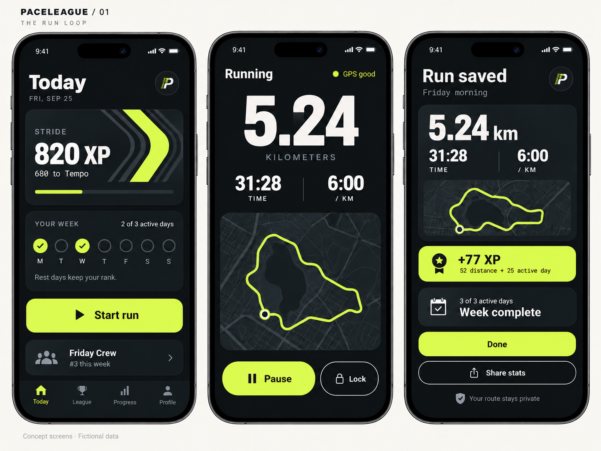
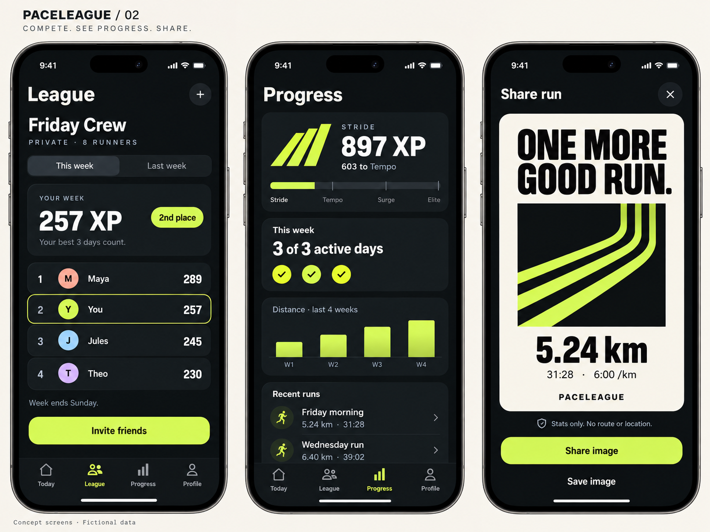
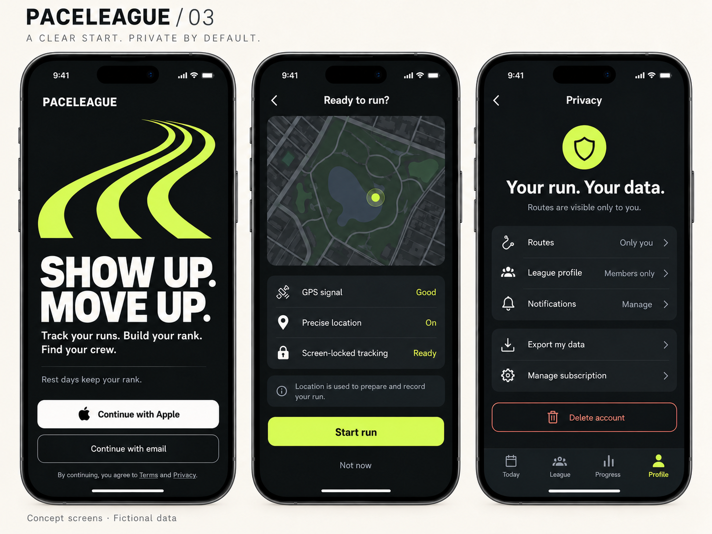
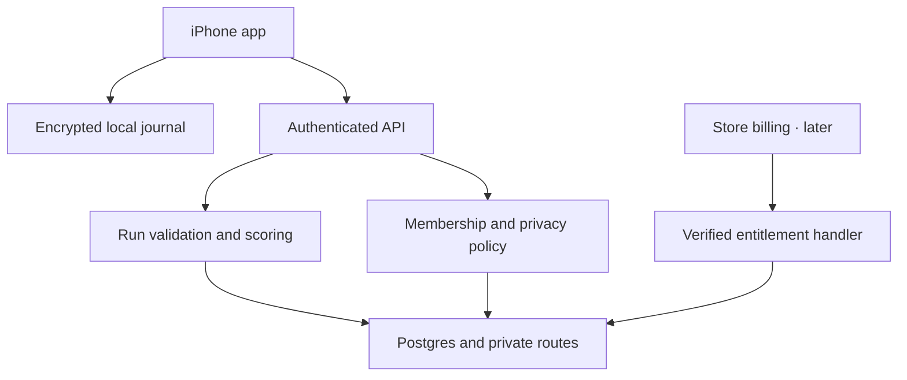
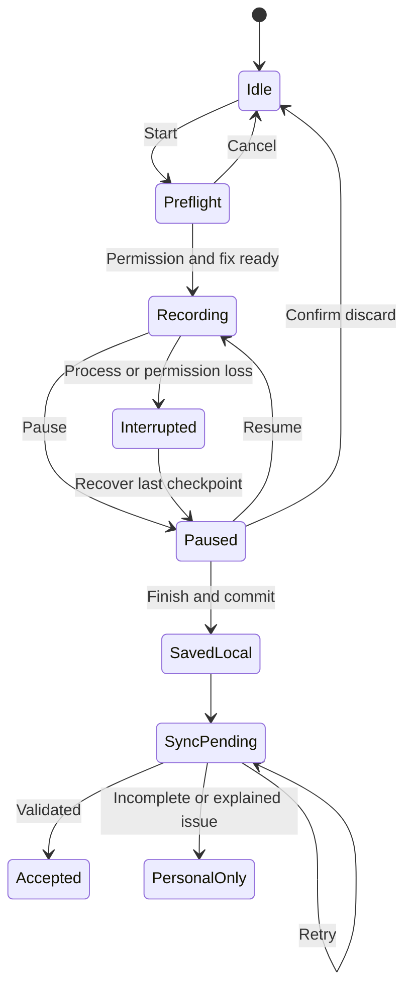

# PaceLeague — Mobile App Design & Build Packet

**An original Runify-inspired running app.** Prepared 2026-09-26 UTC. Working title; brand availability unverified.

This packet tells a designer or developer what to build, how the screens should work, which technology to use, and how to verify the result. It includes three generated design boards with nine screen concepts. The app itself has not been built.

## Start here

| Decision | Recommended starting point |
|---|---|
| First user | Adult recreational runners in small private crews |
| Core loop | Record → save → earn permanent XP → compare a weekly crew score |
| Differentiation to test | No inactivity rank decay; only the best three daily scores count each week; routes stay private |
| First platform | iPhone pilot, English, US; Android follows evidence |
| MVP | Reliable GPS/offline recorder, personal progress, one private league, stats sharing, account/privacy and abuse controls |
| Stack | Expo + React Native + TypeScript; encrypted SQLite journal; Supabase backend; RevenueCat later |
| First paid value | Advanced personal comparisons and share styles after retained use; annual USD 29.99 is a hypothesis |
| First engineering assignment | F01: physical-device GPS, locked-screen recording and interruption recovery |
| Rough delivery model | 10–14 calendar weeks with a small experienced team, including a four-week pilot; 680–1,000 total hours is an assumption to refine |
| Readiness | Planning/design packet complete; technical feasibility and customer demand remain unverified |

For a quick review, read the recommendation, the nine-screen boards, and section 5. For a developer estimate, use the full requirements and technical sections. The exact scoring rules and written design tokens override raster approximations.

## Contents

- [1. Product discovery](#1-product-discovery)
- [2. Product requirements](#2-product-requirements)
- [3. Technical specification](#3-technical-specification)
- [4. Design and screen specifications](#4-design-and-screen-specifications)
- [5. Build plan and developer handoff](#5-build-plan-and-developer-handoff)
- [6. Business budget and launch](#6-business-budget-and-launch)
- [7. Evaluation plan](#7-evaluation-plan)
- [8. Decisions and assumptions](#8-decisions-and-assumptions)
- [9. Sources](#9-sources)
- [10. Applied skills](#10-applied-skills)
- [11. Artifact validation](#11-artifact-validation)

## Design boards

### The run loop

### League, progress and sharing

### Onboarding and privacy

All sample data and maps are fictional. These are static concept references, not interactive screens or store screenshots. Full prompts and design inputs are included in the ZIP.

## 1. Product discovery

### Readiness

**READY WITH ASSUMPTIONS for design review, technical estimation, and a GPS feasibility prototype. BLOCKED for public release and claims of validated demand.** This is a completed planning and visual-design deliverable, not a built application. No interviews, purchases, device tests, or production deployments were performed.

Prepared 2026-09-26 UTC (2026-09-25 in the user's timezone). Working name: **PaceLeague**; name, domain, and trademark availability have not been checked. Decision owner: the founder/user. Proposed engineering, design, and support owners must be assigned before a pilot.

Confirmed request: a mobile app inspired by Runify, a comprehensive packet, generated images, a Markdown file, build scope, and technical direction. Assumptions: the reference is Runify: Running Tracker by OneDegree Labs; an original product; adult recreational runners; English; a US iPhone pilot; Android after the core loop is reliable. No existing repository or supplied research was available in this workspace.

### Executive recommendation

Build a private running competition app around one loop: **start a run → save it reliably → earn visible progress → see your weekly crew standing → return for another run.** Position it around attainable consistency: permanent lifetime ranks, weekly competition based on the best three active days, and private routes.

The first engineering investment should prove locked-screen recording, recovery, and synchronization on physical iPhones. The first product investment should test whether a small crew actually returns. Do not make watch integrations, AI coaching, public feeds, or a global leaderboard prerequisites for this proof.

This is a recommendation, not a proven market opportunity. Runify's first-party descriptions establish an existing product pattern [E-001, E-002]; they do not establish demand for PaceLeague. GPS feasibility constraints come from current Expo documentation [E-003]. The proposed differentiation is a hypothesis [E-010].

### Problem

**Hypothesized user:** an adult who runs recreationally one to four times per week, sometimes with friends, and likes visible progress without needing a formal training plan.

**Hypothesized problem:** activity trackers preserve statistics, but those statistics may provide little reason to come back. A global speed contest can feel unattainable, while a small private crew offers a more relevant comparison. Frequency, severity, and willingness to switch are not yet measured.

**Proposed job:** “After I run, show me that the effort counted, and give my friends and me a simple reason to keep showing up.” The first success is a saved run with understandable rewards. Repeat success is a second useful run and a league that stays active.

**Business hypothesis:** a free social core can create repeated use; some retained users will buy deeper personal insights and share-card customization. No revenue, market size, acquisition cost, or retention has been established.

### Hypotheses and alternatives

| Option | Benefit | Tradeoff | Recommendation |
|---|---|---|---|
| Use an existing tracker and a group chat | Little new software; fastest way to observe group behavior | Manual standings; no original product revenue | Use as a discovery comparison |
| Private challenge app with manually entered runs | Fast and cheap prototype | Easy to falsify; cannot prove GPS reliability | Suitable only for a clearly labeled concept test |
| Import-only leaderboard | Reuses runners' hardware | Platform permissions, duplicates, API restrictions, and rights to display imported data | Defer; not a dependable foundation |
| Own GPS recorder plus one private league | Delivers the complete proposed loop | Recording and offline recovery require real engineering | Recommended MVP |
| Full fitness platform with AI plans and watch apps | Broad feature range | Multiple unproven products and native integrations | Exclude from initial release |

H1: at least 60% of eligible invited pilot users save their first run within seven days. H2: at least 40% of activated users complete an eligible run in their fourth week. H3: at least half of pilot crews retain three active members in week four. These are **provisional decision thresholds**, not industry benchmarks or forecasts.

### Evidence synthesis

| Evidence | What it establishes | What it does not establish |
|---|---|---|
| E-001 / S01: Runify's website | Advertised GPS tracking, XP, ranks, competition, and recaps | Accuracy, retention, revenue, or demand for this concept |
| E-002 / S02: Runify App Store listing | Advertised clubs and social functionality | A requirement to copy every feature or visual treatment |
| E-003 / S03: Expo Location | Background tracking has platform constraints and needs an appropriate native build | Reliability on the eventual target devices |
| E-004 / S04: Supabase RLS | Database policies can restrict access by authenticated identity | Complete application security without correct policies and tests |
| E-005 / S05: Apple review guidance | Relevant review areas include UGC, payments, privacy, and original experiences | Store acceptance or legal compliance |
| E-006 / S06: Apple deletion guidance | Account deletion needs an explicit lifecycle | Automatic subscription cancellation when an app account is deleted |
| E-007 / S07: RevenueCat Expo guide | A supported Expo integration path exists | A configured, tested billing implementation |
| E-008 / S12: Strava API agreement | Material restrictions on competing functionality and cross-user data display | Approval for this app or a workaround around the agreement |
| E-009 / S08: Expo SQLite | A persistent local database and optional SQLCipher integration are available | A secure background key lifecycle or a tested recovery system |
| E-010: product hypothesis | Our proposed reason to choose PaceLeague | Observed user behavior |

### Contradictions and evidence gaps

Runify's website and regional store page display different review totals. No adoption, rating, or GPS-accuracy number is used to size this opportunity. Marketing statements about watch imports do not resolve the rights or technical feasibility of implementing those integrations ourselves.

No customer interviews, support records, cohort data, or purchase receipts were provided. We have not installed or exercised Runify. The research is a first-party feature/documentation review, not a hands-on competitor audit.

The Expo UI skill's broad Expo Go guidance is narrowed by current Expo Location documentation: this app's background recording requires a development build for meaningful verification. Static mockups are not evidence of a functioning recorder.

### Outcome and measurement contract

All current baselines are **not measured**. Founder owns product outcomes; engineering owns operational denominators. Exclude staff, seeded design fixtures, bots, and test purchases. Segment by app version, acquisition cohort, and permission outcome; never send coordinates to analytics.

| Metric | Definition / source | Window | Provisional decision rule |
|---|---|---|---|
| Activation | New eligible accounts with a first server-accepted GPS run / new eligible accounts; onboarding and run events | Seven days from account creation | Investigate onboarding if below 60% with at least 30 eligible accounts |
| Week-four running retention | Activated users with an accepted run on days 22–28 after first accepted run / activated users with complete 28-day observation | Matured activation cohort | Expand only directionally at 40% or more; inspect sample size and reasons |
| Crew viability | Pilot leagues with at least three distinct members each recording a run in week four / pilot leagues that began with at least five members | Four weeks | Seek at least 50% across at least eight leagues; small-sample evidence |
| Save reliability | Finished sessions durably saved locally / sessions for which finish was requested; local operational receipt | Every pilot week | Any confirmed lost completed run blocks expansion |
| Sync reliability | Online saved runs reaching accepted or explained review state within 60 seconds / online saved runs | Every pilot week | Initial target 99%; report network conditions and sample size |
| Purchase conversion | Verified first purchasers / eligible users shown the same priced offer | Separate paid experiment | Judge against contribution and refund data, not installs alone |

“Accepted” means passed the specified checks; it does not certify that an activity was genuine. Personal-only short or incomplete activities remain useful history but are outside ranked-run outcome metrics. Record them separately to detect unfair exclusion.

### Research and validation plan

1. Interview 12 adults: four irregular runners, four consistent runners, and four people who stopped using a fitness app. Include people outside the founder's friend group. Ask about their last three actual runs, existing tracker, skipped runs, sharing habits, and what they already pay for. Avoid asking only whether they like the idea.
2. Test five representative tasks with six participants: start recording, recover a paused run, explain XP, join a private league, and find export/deletion. Record unaided completion and confusion. The generated boards support a walkthrough; a later clickable prototype is needed for interaction timing.
3. Recruit eight crews of five to ten adults for a four-week TestFlight pilot after the device gate. Provide the same onboarding and disclose pilot limitations. Recruitment messages and spending are prepared work only; none have been sent or spent.
4. Compare perceived motivation and actual return behavior with the prior tracker/group-chat routine. This is observational unless cohorts are randomly assigned; do not claim causality.
5. Run the paid experiment only when premium capabilities work. Use real transactions and refund records. Signups and stated willingness to pay are separate evidence.

### Gate results

| Gate | Status | Evidence needed next |
|---|---|---|
| Problem | Hypothesis | Interviews and observed workarounds |
| Evidence | Partial | Primary documentation collected; customer evidence absent |
| Decision | Draft | Founder confirms segment, platform order, spending range |
| Specification | Prepared | Engineering review of GPS, scoring, and data lifecycle |
| Prototype | Visual concepts complete | Interactive usability and assistive-technology checks |
| Agent/action | Not applicable | No autonomous agent or AI coach in V1 |
| Release | Not started | Real builds, store configuration, operator facts, and verification |

The next bounded action is F01 in PLAN.md: a local GPS recorder feasibility slice on two physical iPhones. Public release remains a later decision; this packet does not claim that it happened.

### Source links

[Full source register](SOURCES.md).

## 2. Product requirements

### Document control

Status: **DRAFT for implementation planning**. Product: a private running competition app. Decision owner: founder/user; engineering and design approvers: unassigned. No human approval of the proposed product decisions is recorded. Related files: DISCOVERY_PACKET.md, TECHNICAL_SPEC.md, PROTOTYPE_BRIEF.md, EVAL_PLAN.md, and PLAN.md. Version 1.0, 2026-09-26 UTC.

### Problem and evidence

Help an adult recreational runner turn a recorded run into understandable progress and a small-group reason to return. The category pattern is documented by Runify [E-001, E-002]; unmet need and willingness to pay remain hypotheses [E-010]. Build an original interface and original rules. Runify is a reference, not an affiliation or a specification to reproduce.

**Promise:** “Track your runs. Build your rank. Find your crew.” Proposed difference: rank does not decay with inactivity; only the best three daily scores determine each weekly competition; routes never appear to league members in V1.

### Goals and success measures

| Goal | Metric | Baseline | Initial threshold | Window / instrumentation |
|---|---|---|---|---|
| First useful outcome | Seven-day activation | Not measured | 60% with at least 30 accounts | Account creation to first accepted run; server events |
| Useful repetition | Week-four running retention | Not measured | 40%, directional | Matured 28-day activation cohort |
| Viable social loop | Crews with three active members in week four | Not measured | Half of at least eight pilot crews | Weekly membership/run aggregates |
| Preserve effort | Completed-run save reliability | Not measured | No confirmed lost completed runs | Device test and pilot operational receipts |
| Earn revenue later | Verified purchase contribution | Not measured | Positive before acquisition, then below bounded CAC ceiling | Separate V1.1 paid experiment |

These are test rules, not forecasts. The discovery packet defines denominators, exclusions, and owners.

### Non-goals

V1 excludes public feeds, comments, direct messages, global/country leaderboards, pace races, cash prizes, wagering, route discovery, navigation, automatic pause, live location sharing, training plans, medical advice, AI coaching, wearable apps, HealthKit imports, Strava imports, Garmin sync, treadmill distance estimation, and Android launch. No paid feature changes XP or ranking. Short runs and incomplete recordings can still be saved as personal history.

### Release scope

| Capability | Free pilot / V1 | V1.1 after retention | Later, conditional |
|---|---|---|---|
| Phone GPS recording, pause, resume, offline save | Build | Improve from real evidence | Android recorder |
| Lifetime ranks and personal history | Build | Advanced trend comparisons | Further achievements |
| One private league, 20 people, invite link/code | Build | Keep free | Additional leagues only after demand |
| Stats-only share image | One template | Optional premium styles | Privacy-reviewed route sharing |
| Account/export/deletion, moderation, support | Build | Maintain | Market-specific adaptations |
| Billing | Free pilot; no paywall | Annual Pro with working premium features | Additional offers after evidence |
| Watch/provider imports | Exclude | Separate feasibility decision | Explicit rights, provenance, deduplication, device verification |

### Users, jobs, and permissions

| Actor | Allowed | Prohibited |
|---|---|---|
| Visitor | View welcome, terms, privacy, limited invite preview | Read members, runs, or coordinates |
| Runner | Record; view/edit own title; delete/export own records; see own league standings | Modify distance/time after acceptance; write own score or entitlement |
| League owner | Runner actions; invite, rename, remove members, rotate invite | Access routes, email addresses, or other users' private history |
| Moderator | Review reported alias/league name; resolve conduct reports with audit trail | Browse raw routes as a routine moderation tool |
| Privileged operator | Restore service, investigate tightly scoped incidents, reconcile data | Unlogged casual access or granting score/payment from the client |
| Billing service (V1.1) | Reconcile verified entitlements | Change runs or competitive XP |

Identity comes from verified authentication, membership from current server records, and paid access from verified purchase state. They are separate checks.

### Proposed behavior

The new runner signs in, chooses an alias, units and an optional one-to-three-day weekly goal, then reaches Today. “Start run” opens preflight and requests location in context. After a GPS fix and the needed permission, a cancellable three-second countdown starts recording. Pause freezes active elapsed time and distance accumulation; resume creates a new segment. Finish is available from paused state and saves locally before networking. The summary displays provisional XP until accepted by the server. League points update only after acceptance. “Done” returns to Today; sharing uses a separate stats-only preview and the system share sheet.

The runner can create or join one league after the first run, or use an invitation during onboarding. Joining is optional; the recorder and personal progress remain useful alone. The invite flow requires an explicit join action, restores the intended destination after sign-in, and never uploads contacts.

### Requirements and acceptance criteria

#### REQ-001 — Account and onboarding

- Rationale: D-001, D-009; account lifecycle evidence E-006.
- Actor/precondition: visitor with network access for first sign-in.
- Behavior: Apple sign-in and email OTP; alias, units, adult-pilot eligibility acknowledgement, and optional weekly goal. Alias is 2–24 characters; no contact discovery or public searchable profiles. Default units follow locale; metric is used in design fixtures.
- Recovery: cancellation returns to welcome; expired OTP can be requested again with rate limits; session expiry prompts reauthentication while keeping the local run associated with its original account.
- AC-REQ-001-01: Each provider independently restores the same account after cold restart; a used or expired OTP does not authenticate.
- AC-REQ-001-02: Account B cannot read account A's local queue after sign-out or login; unfinished uploads cannot silently transfer ownership.
- Verification: EV-001, provider/device tests and cross-account integration tests.

#### REQ-002 — Permission and preflight

- Rationale: E-003, D-012.
- Behavior: describe why location is needed before native prompts; obtain foreground/precise location and background permission for screen-locked recording using the chosen version's native APIs. Preflight may request a short-lived current fix; leaving preflight stops that request.
- Recovery: denied/restricted or approximate-only location explains the limitation and offers Settings or “Not now.” The full ranked recorder is disabled until precise/background requirements are met; history and league remain accessible. Do not mislabel foreground-only recording as locked-screen capable.
- AC-REQ-002-01: “Ready” appears only when observed permission state and a fresh fix meet configured criteria; revoked permission changes the visible state.
- AC-REQ-002-02: “Allow Once,” permanent denial, no GPS fix, and permission revoked mid-run each have an exercised recovery path; no repeat prompt loop.
- Verification: EV-002 on physical devices, not a web preview.

#### REQ-003 — Record, pause, resume, and recover

- Rationale: E-003, E-009, D-002.
- Behavior: one active run per device; persist points and state through a single recording service; record with screen locked; show distance, active elapsed time, average pace, GPS quality, pause, and touch lock. Touch lock is an accidental-tap safeguard, not device security. No automatic pause in V1.
- Recovery: signal gaps remain gaps; never draw invented connecting distance. After process termination, offer the last durable partial run on next launch and label it interrupted; do not promise tracking while force-quit.
- AC-REQ-003-01: A 30-minute locked-screen route, manual pause/resume, phone call interruption, and offline interval produce one durable session with pause intervals excluded.
- AC-REQ-003-02: Killing the app yields a recoverable checkpoint after relaunch and no claim of uninterrupted tracking; starting a second run requires resolving the first.
- Verification: EV-003, device trace and known-distance comparison.

#### REQ-004 — Finish and preserve the result

- Rationale: D-002; avoiding lost effort.
- Behavior: paused screen offers Resume, Finish, and Discard. Finish durably commits the local session and summary before “Run saved.” Discard is a destructive confirmation. Saving a short or incomplete run is allowed even if it earns no ranked XP.
- AC-REQ-004-01: Finishing offline and reopening the app preserves distance, active elapsed time, segments, and pending-sync status.
- AC-REQ-004-02: Repeated Finish taps create one session; a failed local write cannot show success and retains the active session for retry.
- Verification: EV-004, disk failure injection and app relaunch.

#### REQ-005 — Idempotent synchronization

- Rationale: E-004, D-003.
- Behavior: account-scoped durable outbox; batch route chunks; authoritative server validation; upload/retry/finalize status. Never require a network response to stop a run. Reauthentication retains the queue. An older duplicate reply cannot overwrite a newer result.
- AC-REQ-005-01: Ten concurrent finalize requests for the same run revision yield one accepted result and one set of daily-score effects.
- AC-REQ-005-02: A disconnected upload resumes missing chunks; conflicting contents at an existing sequence number fail with a recoverable conflict, not double credit.
- Verification: EV-005, network fault and concurrency tests.

#### REQ-006 — Transparent XP and ranks

- Rationale: D-004, D-005; motivation hypothesis E-010.
- Behavior: use the versioned scoring contract in TECHNICAL_SPEC.md. Show separate lifetime rank, daily earned XP, and weekly league score. Points are server-controlled; provisional local estimates are clearly labeled. Rank never decays due to inactivity; deletion or invalidation can reverse credited data.
- AC-REQ-006-01: The 5,240 m, 31:28 first eligible activity of a day earns 77 XP; lifetime 820 becomes 897; 603 remains to Tempo.
- AC-REQ-006-02: Splitting one distance into runs cannot evade the daily cap; duplicate upload, timezone change, pause, future timestamp, and deleted run cases follow the documented results.
- Verification: EV-006, golden scoring cases and transaction tests.

#### REQ-007 — Private weekly league

- Rationale: E-002, E-010, D-005, D-008.
- Behavior: one league per runner, maximum 20 members including owner. Create/join/invite, current and prior week standings, own position, rules, exact local closing time, and provisional/final state. Member preview exposes alias, rank tier, weekly score only. Tie scores share a rank; alphabetical alias then member ID stabilizes display without awarding a better place.
- Recovery: expired/full/revoked invites are explicit; leaving removes current visibility and standings; moving between leagues requires leaving first. New members' current-week score starts from eligible segments at or after joining. Ownership must be transferred or the empty league closed before its owner leaves.
- AC-REQ-007-01: A valid invitation followed by explicit acceptance adds the user once and shows standings only after server membership exists.
- AC-REQ-007-02: Revoked membership denies reads immediately; parallel joins cannot exceed capacity; the weekly rollover uses the named timezone including daylight-saving changes.
- Verification: EV-007, two-user access, capacity race, and calendar tests.

#### REQ-008 — Progress and personal history

- Rationale: D-002, E-010.
- Behavior: lifetime tier, weekly goal, four-week distance view, paginated history, and own run detail including a private route and splits. Rename title only; no edits to accepted distance, time, or raw points. Explain personal-only runs and review status.
- AC-REQ-008-01: History remains after restart, uses chosen distance units without changing stored meters, and supports empty/partial/offline states.
- AC-REQ-008-02: Deleting a run removes it and its route from all current views and recalculates affected totals; no paid gate blocks data access or export.
- Verification: EV-008, persistence, units, pagination, and deletion tests.

#### REQ-009 — Safe share card

- Rationale: D-006.
- Behavior: render a separate 4:5 or 9:16 stats composition with distance, active elapsed time, pace, and app brand. No map, place label, precise start time, location metadata, email, or hidden coordinates. Preview before opening the system share sheet; user selects the destination.
- AC-REQ-009-01: Exported raster contains the displayed statistics and no route layer or location metadata; share cancellation creates no post.
- AC-REQ-009-02: The accessible preview has a text summary; missing photo-library permission does not block use of the share sheet.
- Verification: EV-009, image/metadata inspection and native sharing checks.

#### REQ-010 — Privacy, export, and account deletion

- Rationale: E-004, E-006, D-006.
- Behavior: routes are owner-only. Export provides personal activity data and GPX/JSON through authenticated delivery. In-app deletion requires recent authentication, confirms consequences, immediately hides the profile/league presence, and queues retryable cleanup. Explain separate store billing management when relevant. Do not require subscription cancellation before accepting deletion.
- AC-REQ-010-01: A different user, league owner, and anonymous request cannot retrieve a route or export, including by guessed IDs and stale links.
- AC-REQ-010-02: A deletion job removes owned primary data and local caches under the proposed lifecycle, revokes sessions, retries interrupted steps, and records completion without retaining route data in logs.
- Verification: EV-010, multi-identity tests and disposable-account deletion drill.

#### REQ-011 — Basic social abuse controls

- Rationale: E-005; aliases and league names are user-generated even without chat.
- Behavior: server-side name validation/filtering, report alias/league/member, block a user, leave a league, owner removal, moderator queue, and reachable support. Blocking removes mutual profile visibility and invitation capability; a hidden row retains aggregate rank gaps so standings are not falsified. Do not expose a blocked alias via notifications or exports.
- AC-REQ-011-01: A report reaches a restricted queue with its content snapshot; moderator action and reason are audited; reviewer contact instructions are real before launch.
- AC-REQ-011-02: A blocked or removed user cannot bypass restrictions through a cached invite or direct API request.
- Verification: EV-011, abuse flow and access tests.

#### REQ-012 — Optional reminders

- Rationale: D-004, privacy/minimization decision.
- Behavior: one optional local reminder at a runner-selected time, opt-in after value is experienced. No rank-loss threats, pace pressure, or sensitive lock-screen copy. No remote social pushes in V1.
- AC-REQ-012-01: Opt-out or sign-out cancels scheduled reminders; timezone/daylight-saving handling does not duplicate them.
- AC-REQ-012-02: Notification denial leaves all core features usable.
- Verification: EV-012, device scheduling tests.

#### REQ-013 — Optional Pro purchase (V1.1, not a V1 dependency)

- Rationale: E-007, D-007; business experiment, not validated demand.
- Behavior: native store purchase via RevenueCat, verified entitlement, restore, manage subscription, and clear localized price/period/renewal copy. Annual USD 29.99 is an unconfigured test hypothesis. Pro provides implemented advanced personal comparisons and premium share styles; core tracking, ranks, league membership, privacy, history, and export remain free.
- AC-REQ-013-01: Sandbox purchase, restore after reinstall, pending approval, cancellation-at-renewal, expiry, refund/revocation, and account switch produce documented entitlement states.
- AC-REQ-013-02: Forged, duplicate, delayed, or out-of-order billing events cannot grant or resurrect access; billing failure never blocks finishing a run.
- Verification: EV-013, purchase sandbox and webhook tests after premium features exist.

#### REQ-014 — Accessible native UX

- Rationale: D-001, inclusive product design decision.
- Behavior: VoiceOver labels/order, scalable typography, non-color state indicators, reduced-motion support, safe areas, accessible pause/finish, and one-handed control sizes. Text-only summaries accompany charts and maps.
- AC-REQ-014-01: A VoiceOver user can start, pause, finish, find their result, and initiate deletion without unexplained icon-only actions.
- AC-REQ-014-02: 200% text on the smallest supported screen has no clipped primary action or overlapping metrics; chart values are available in text; reduced motion removes rank-up animation.
- Verification: EV-014, device accessibility and measured color checks.

#### REQ-015 — Minimized telemetry and operations

- Rationale: D-006, reliable product measurement.
- Behavior: event allowlist; no coordinates, routes, tokens, email, run titles, or precise health statistics in crash/analytics payloads. Session replay disabled. Operational events record reason codes, latency buckets, build ID, and pseudonymous account/run IDs only when necessary.
- AC-REQ-015-01: Test events reach the intended non-production dashboard without sensitive fields; production and test cohorts remain distinct.
- AC-REQ-015-02: Loss of analytics does not block saving; outbox/backlog alarms and reporting failure have assigned responses before pilot expansion.
- Verification: EV-015, payload inspection and incident drill.

### Data, state, and interfaces

The technical spec owns the proposed schema, API contracts, recording states, scoring algorithm, and deletion lifecycle. Local SQLite is authoritative for an unsynced recording; the server is authoritative for accepted statistics, XP, membership, and entitlements. No client write can directly grant any of those authorities. Every privileged mutation checks current identity and object access, including jobs and billing handlers.

### Non-functional requirements

All thresholds are initial **acceptance targets to verify**, not demonstrated performance or guarantees. Linked requirements provide rationale and ownership.

| ID | Quality | Target / boundary | Verification |
|---|---|---|---|
| NFR-001 | Local durability | Checkpoint at most every 5 seconds while callbacks arrive; zero lost completed sessions in 50 deliberately interrupted test sessions | EV-003/004; OS-suppressed callbacks reported separately |
| NFR-002 | Distance | Median absolute error within 5% on ten measured 1–5 km open-sky routes across two iPhones | EV-003; include poor-signal cases without treating estimate as certified distance |
| NFR-003 | Battery | Initial goal: at most 8 percentage points per hour median, screen locked, on two named devices; compare with idle baseline | EV-003; report device, OS, battery health and settings |
| NFR-004 | Responsiveness | Pause feedback within 150 ms; local summary within 1 second at p95 on target device | EV-004; transitions must not wait for network |
| NFR-005 | Network | Online finalize p95 within 5 seconds at pilot load; retryable reads time out after 10 seconds | EV-005; separate route upload duration |
| NFR-006 | Access | All route/history/league mutations pass absent-user, other-user, stale-member, invalid-input tests | EV-007/010/011 |
| NFR-007 | Accessibility | Text contrast at least 4.5:1 for normal text; controls at least 44×44 pt on iOS, plan 48 dp on Android | EV-014; actual device/layout checks required |
| NFR-008 | Payload limits | 500 points or 128 KiB per upload chunk; maximum 50,000 points per run; bounded pagination | EV-005; oversized input has no partial unauthorized writes |
| NFR-009 | Pilot scale | Exercise 1,000 accounts, 50 leagues and 25 concurrent finalizations in staging | EV-005/007; a test load, not a user forecast |
| NFR-010 | Data lifecycle | Hide deleted account promptly; complete primary-data cleanup within 7 days; proposed backup expiry at most 30 days | EV-010; verify actual provider settings before promising this |
| NFR-011 | Maintainability | Versioned DB migrations and scoring, reproducible dependency lock, isolated environments | EV-015 and PLAN milestones |

### UX and content contract

Four tabs: Today, League, Progress, Profile. Run flow uses a full-screen stack above tabs to prevent accidental navigation. Native back, sheets, alerts, safe areas, and system share behavior take precedence over a raster concept. Screen specifications and tokens are in PROTOTYPE_BRIEF.md and design-tokens.json. Generated text or geometry never overrides this written behavior.

### Analytics and evaluation

Use account_created, onboarding_completed, permission_result, run_started, run_saved_local, run_sync_outcome, league_joined, league_week_participated, share_sheet_opened, deletion_requested, and deletion_completed. Paid stage adds offer_viewed, purchase_verified, entitlement_changed, and refund_observed. Deduplicate event IDs; record schema version and environment. Never infer a shared post from share-sheet opening. Definitions and post-launch decisions appear in EVAL_PLAN.md and BUSINESS_AND_LAUNCH.md.

### Dependencies, risks, and open decisions

The first blockers to public release are real device evidence, named operator/support facts, final account lifecycle settings, moderation coverage, store configuration, and user validation. The largest architecture risk is background GPS reliability. The largest commercial risk is a compelling-looking league that fails to retain crews. External imports are not dependencies for V1. All recommended services require actual setup and version compatibility review.

### Rollout and rollback

Progress from internal devices to eight invited TestFlight crews, then a limited public launch only after gates pass. Keep ranking disabled by a server flag until accepted-run validation and concurrency tests pass; maintain recording/history when competition is disabled. Roll back client JavaScript only through a tested compatible runtime. Native changes require a new build; store installations cannot be instantly rolled back. Use backward-compatible server changes, a preserved prior release, and an incident runbook. Suspend new invites or Pro sales independently of the recorder.

### Traceability matrix

| Claim / rationale | Requirement | Acceptance IDs | Evaluation | Current result |
|---|---|---|---|---|
| E-006, D-009 | REQ-001 | AC-REQ-001-01 / 02 | EV-001 | Not run |
| E-003, D-012 | REQ-002 | AC-REQ-002-01 / 02 | EV-002 | Not run |
| E-003, E-009 | REQ-003 | AC-REQ-003-01 / 02 | EV-003 | Not run |
| D-002 | REQ-004 | AC-REQ-004-01 / 02 | EV-004 | Not run |
| E-004, D-003 | REQ-005 | AC-REQ-005-01 / 02 | EV-005 | Not run |
| E-010, D-004 / 005 | REQ-006 | AC-REQ-006-01 / 02 | EV-006 | Not run |
| E-002, D-008 | REQ-007 | AC-REQ-007-01 / 02 | EV-007 | Not run |
| E-010, D-002 | REQ-008 | AC-REQ-008-01 / 02 | EV-008 | Not run |
| D-006 | REQ-009 | AC-REQ-009-01 / 02 | EV-009 | Not run |
| E-004, E-006 | REQ-010 | AC-REQ-010-01 / 02 | EV-010 | Not run |
| E-005 | REQ-011 | AC-REQ-011-01 / 02 | EV-011 | Not run |
| D-004 | REQ-012 | AC-REQ-012-01 / 02 | EV-012 | Not run |
| E-007, D-007 | REQ-013 | AC-REQ-013-01 / 02 | EV-013 | Deferred V1.1 |
| D-001 | REQ-014 | AC-REQ-014-01 / 02 | EV-014 | Not run |
| D-006 | REQ-015 | AC-REQ-015-01 / 02 | EV-015 | Not run |

### Approval gate

Planning packet complete; implementation evidence absent. Readiness: **READY WITH ASSUMPTIONS for estimation and the bounded technical prototype; BLOCKED for public release**. Founder approval, named delivery owners, device feasibility, and customer evidence must be recorded at the relevant next checkpoints. There is no requirement to approve this packet merely to view or use its design artifacts.

## 3. Technical specification

This is a proposed architecture for REQ-001 through REQ-015. No application code or infrastructure was created. Verify exact dependency versions against the selected Expo SDK at project kickoff; pin the lockfile and keep a compatibility record. Do not independently install the newest React Native into an Expo project.

### Recommended stack

| Layer | Recommendation | Reason / tradeoff |
|---|---|---|
| Mobile | React Native, Expo, TypeScript | Shared product code and a later Android path; native behavior still needs platform tests |
| Navigation | Expo Router with native stacks and standard four-tab navigation | Predictable deep links and isolated run flow; avoid unstable tab APIs unless deliberately validated |
| UI | React Native components, safe-area-context, tokenized styles, restrained Reanimated/haptics | Native semantics and an auditable design system; no heavy UI kit required |
| Recorder | expo-location and top-level expo-task-manager task | Documented foreground/background location path; prove locked-screen behavior first [S03] |
| Local persistence | expo-sqlite, SQLCipher in the native development build | Durable route batches, session state, and outbox; encryption key accessibility requires careful device verification [S08] |
| Credential/key storage | expo-secure-store | Refresh tokens and per-account database key; never AsyncStorage for secrets |
| Map | react-native-maps; Apple Maps on iOS initially | Known native renderer; provider attribution must remain in real screens [S09] |
| Remote backend | Supabase Auth, Postgres, private Storage, Edge Functions | One backend for identity, relational league rules and route objects; permissions require explicit design [S04] |
| Network state | TanStack Query for reads; a separate SQLite outbox for durable mutations | Query cache is not the authoritative recording journal |
| Validation | Runtime schemas, such as Zod, at every API boundary | Types alone cannot validate hostile payloads |
| Sharing | Dedicated view renderer + native share sheet | Share only selected statistics, not a screenshot of a private route screen |
| Reminders | expo-notifications, local only in V1 | Smaller operational/privacy footprint |
| Billing, later | RevenueCat + native store purchases | Consolidated entitlement lifecycle; development-build and sandbox verification required [S07, S11] |
| Diagnostics | Sentry candidate, subject to SDK/version and payload review | Error monitoring with explicit scrubbers and replay disabled; not yet configured |
| Analytics | Small first-party event table initially | Avoid an extra analytics vendor until the event model and data sharing are understood |
| Delivery | EAS development builds, TestFlight, CI using repository-native checks | Physical-device proof and traceable builds; cloud services require account setup |

**Native fallback:** if two focused fixes cannot meet the GPS checkpoint and locked-screen gates, compare a narrow native recorder module with a native iOS app. Decide on evidence before building the remaining UI. Web/PWA recording is not the target.

### System boundaries

The app persists effort locally before attempting upload. The API authenticates identity, validates input, checks object ownership/current membership, and calls the canonical domain operation. Supabase row policies and private Storage add defense in depth. A privileged backend credential bypasses some database controls and therefore must never be in the mobile bundle; its code still enforces the same explicit policies. A read-only league projection returns only the fields the league is entitled to see.

### Recorder state machine

- Keep recording state in SQLite, not only React memory. A single service serializes state changes and point writes. Keep one active session pointer per device/account; enforce it transactionally.
- Request a short foreground fix only while preflight is visible. Stop continuous subscription on Finish, Discard, or fatal permission loss. Do not auto-start GPS at app launch or from a reminder.
- Use high-accuracy samples appropriate to the active workout and a distance/update configuration chosen in the spike. OS scheduling is advisory; do not promise one sample per second.
- Store each point with sequence number, timestamp, horizontal accuracy, latitude/longitude, and segment ID. Save pause/resume events separately. Use monotonic elapsed time while alive; persist segment/checkpoint elapsed values for recovery, with UTC timestamps for server checks.
- Write a transaction when a batch arrives, with a target of no more than five seconds of received data uncommitted. If no callbacks arrive, mark poor signal; persistence cannot recover locations the OS never delivered.
- Display average active pace in V1, not a noisy instant pace. Active elapsed time excludes manual pauses; it is not claimed to be automatically detected moving time.
- Do not add distance across pause boundaries, invalid jumps, or GPS gaps over the configured gap threshold. Initial tuning values: fresh fix within 15 seconds, horizontal accuracy no worse than 50 m, gap threshold 15 seconds. Treat these as calibration inputs and version them.
- Flag implausible speed/jumps for review; an initial 12 m/s trigger is a heuristic, not proof of cheating. Validation quality is measurable; authenticity is not guaranteed by GPS alone. No monetary prizes in this design.
- A force-quit stops the promised recording service. Recovery uses the last stored checkpoint, labels the missing interval, and lets the user save the partial run or resume with a new segment. Never fill the gap with a straight line or elapsed time until reopen.
- Prepare a database key available while the device is locked after the first unlock, using an appropriate supported platform accessibility setting. Verify SQLCipher + background task + SecureStore together on the chosen SDK. A device reboot or an unavailable key must fail transparently; do not silently write an unencrypted replacement.

### Score contract — version 1

These are PaceLeague's proposed rules, not Runify's formula. They implement REQ-006/007. Show a plain-language rules sheet in the app.

1. A server-accepted recorded activity is eligible for scoring if it has at least 100 m and 60 seconds of active elapsed time, passes timestamp/segment checks, has at least 80% usable sample coverage under the implemented coverage definition, and is not held for a material anomaly. Short/incomplete runs remain personal history. Measure false rejection with actual routes before launch.
2. Scoring days and weeks in the pilot use the named IANA zone **America/Chicago**, disclosed in league rules. All users use the same competition calendar. User notification timezone is separate. Weeks begin Monday 00:00 and end the following Monday 00:00, using timezone-aware calendar arithmetic. Never assume a day is exactly 86,400 seconds.
3. Allocate each accepted segment's distance and active elapsed time to its competition day. A segment crossing midnight is split at the boundary using its timestamps. No client timezone override changes the scoring calendar.
4. Let D be the sum of accepted meters for a user/day and T the accepted active elapsed seconds. `distance_xp = min(100, floor(D / 100))`. `active_day_bonus = 25 if D >= 1000 and T >= 300 else 0`. `daily_xp = distance_xp + active_day_bonus`, maximum 125. Aggregate distance before flooring; splitting a run cannot increase the cap or rounding benefit.
5. Lifetime XP is the sum of credited daily XP. It never decreases because of rest. Deletion, duplicate correction, or invalidation triggers explicit recomputation and can decrease it. Explain the reason when a correction changes a tier.
6. Weekly league XP is the sum of the **three highest daily XP values** earned while a member during that league week, capped at 375. Compute league daily XP from the eligible post-join segments, rather than copying a lifetime daily total that could contain pre-join miles. Membership must remain active to appear in standings.
7. Scores remain provisional until the week closes plus 24 hours. Runs uploaded after that settlement deadline may add personal history/lifetime XP but do not add to the closed league week. Current-week runs should be uploaded promptly. Runs first received more than 72 hours after recording remain personal-only pending a documented review; never silently backdate them. Deletions and integrity corrections can revise a closed week, with a revision label.
8. Tied scores receive the same competition rank (1, 2, 2, 4). Alias/ID sort is only for stable row order, never a tie-breaking reward. Weekly results do not demote permanent tiers.

Leaving and rejoining starts a new membership period. Earlier segments from a previous membership period do not reappear in the current-week score; the leave confirmation explains this. Keep membership-period records so scoring cannot accidentally reuse an old join timestamp. Personal lifetime XP is unaffected by leaving a league.

#### Tier thresholds

| Tier | Minimum lifetime XP | Next tier |
|---|---:|---:|
| Seed | 0 | 500 |
| Stride | 500 | 1,500 |
| Tempo | 1,500 | 4,000 |
| Surge | 4,000 | 10,000 |
| Elite | 10,000 | None in V1 |

The in-tier progress fraction is `(XP - tier_floor) / (next_tier_floor - tier_floor)`. Elite shows a completed tier and lifetime XP; no fictional next threshold. Changing the rules requires a versioned migration and an explicit policy on old scores, preferably at a future week boundary.

#### Golden fixtures

| Case | Expected result |
|---|---|
| First 5,240 m / 1,888 s run of day | 52 distance + 25 active-day = 77 XP |
| Same run uploaded twice | Still 77 XP |
| Two accepted 2,620 m runs same day | Combined 5,240 m → 77 XP total, not 102 |
| 600 m / 240 s followed by 400 m / 180 s | Daily total 1,000 m / 420 s → 35 XP |
| 10,000 m or more plus at least 300 s in one day | Daily maximum 125 XP |
| Daily scores 125, 100, 80, 77 | Weekly league score 305; all 382 still count toward lifetime XP |
| Monday 6.60 km, Wednesday 6.40 km, Friday 5.24 km | 91 + 89 + 77 = 257 weekly XP |
| Lifetime 820 before Friday's run | 897 after; 603 to Tempo; in-tier progress 39.7% |
| User changes phone timezone | No change to competition-day allocation |
| Delete Friday's run | Recompute affected totals from remaining accepted data; reverse 77 if no other same-day activity |

The 80% coverage metric must be implemented as usable recorded active-time intervals divided by total active elapsed time, capped per adjacent sample gap at the accepted gap threshold; gaps are not bridged. Timestamp manipulation and GPS spoofing remain risks. Store the validator version, reasons, and a personal-only fallback; do not accuse a runner based on a single heuristic.

### Proposed data model

| Entity | Core fields | Ownership / constraints |
|---|---|---|
| profiles | user_id, alias, units, goal_days, notification_tz, eligibility_ack_at | User-owned settings; server-controlled status; email stays in auth provider |
| runs | id, owner_id, client_run_id, start/end UTC, active_ms, distance_m, source, status, version, validator_version, title | Unique `(owner_id, client_run_id)`; client cannot edit accepted totals |
| route_chunks | run_id, sequence, checksum, staged object key, point_count | Unique `(run_id, sequence)`; owner-only staged access; immutable after finalize |
| run_routes | run_id, private object key, checksum, segmentation metadata | Never returned by league endpoints; authenticated owner retrieval |
| daily_scores | owner_id, competition_date, rule_version, distance_m, active_ms, xp, revision | Unique per user/date/rule; server writes only |
| xp_ledger | id, owner_id, date, cause_id, revision, delta, created_at | Append corrections; unique cause/revision; no client writes |
| leagues | id, name, owner_id, calendar_zone, capacity, status | Owner actions validated; zone fixed for the pilot |
| league_members | league_id, user_id, joined_at, left_at, role | One active league per user; capacity checked in transaction |
| league_invites | id, league_id, token_hash, expires_at, revoked_at, creator_id | Random link/code; expiry seven days; no plain token logs |
| league_week_scores | league_id, week_start, member_id, xp, revision, settled_at | Derived projection; never a client-writable score table |
| blocks / reports | reporter/blocker, target, reason code, content snapshot, status | Minimum necessary data; moderator access only for reports |
| deletion_jobs / export_jobs | owner_id, requested_at, state, retry_count, expiry, result key | Recent-auth request; bounded retry; private result delivery |
| operational_events | event_id, schema_version, environment, allowlisted fields | Redacted and deduplicated; short retention |
| entitlements / billing_events | user_id, provider IDs, product, verified state, expiry, event_id | V1.1 only; unique provider event; server updates |

Local tables: `active_session`, `track_points`, `session_events`, `saved_runs`, `outbox`, `cached_summaries`, and schema version. Namespace databases and network caches by verified account identity. Sign-out stops recording or asks the user to finish/discard first, warns about unsynced work, cancels reminders, locks that account's encrypted database, and clears displayed/query caches. Unsynced records can only be reopened by that same account. Explicit local deletion removes the database/key after confirmation; do not destroy a pending run merely because a token expires.

### API outline and transaction rules

These are proposed contracts, not deployed URLs. All endpoints use HTTPS, runtime schema validation, explicit size limits, and sanitized error codes. Derive the caller from a verified token. Reject caller-supplied owner/role/XP fields.

| Operation | Inputs | Result / controls |
|---|---|---|
| POST /runs | client_run_id, start metadata, source | Create/reuse owned upload session; same idempotency key + changed body → conflict |
| PUT /runs/{id}/chunks/{seq} | points, checksum | Owner check, 500-point/128-KiB cap, checksum match for retries |
| POST /runs/{id}/finalize | expected version, ordered manifest, pause events | Validate completeness; queue processing; return pending/accepted/personal-only with reason |
| GET /runs and /runs/{id} | cursor/limit, owned ID | Paginated own history; route requires separate authorized owner fetch |
| PATCH /runs/{id} | title, expected version | Title only; block attempts to edit accepted statistics |
| DELETE /runs/{id} | expected version | Tombstone + score recalculation + route cleanup; idempotent |
| POST /leagues and /leagues/join | name or invite token | Current membership/capacity transaction; explicit user action |
| GET /leagues/{id}/standings | week, cursor | Current membership + block filtering; no raw routes/contact fields |
| POST /reports and /blocks | bounded target/reason | Access validation, abuse limits, no unrestricted text upload |
| POST /exports and /account/deletion | recent-auth proof | Async job ID; user can view own status |
| POST /billing/webhook | authenticated provider event | V1.1; verify configured signature/auth, persist event once, reconcile provider state |

Finalize should produce one durable job and transactional outbox record before acknowledgement. A retry resumes the same job. The worker recomputes statistics from staged points, locks affected daily-score rows in a stable order, and commits run acceptance, daily-score revisions, ledger deltas, and projection-update intent atomically. Two runs on one day must not each receive an independent day bonus. League projection workers are idempotent and expose their last update time; an asynchronous league update must not change a confirmed personal save into an error.

Use retry with capped exponential backoff and jitter for network/5xx errors, honor rate-limit responses, and stop automatic retries for permanent validation errors. Reauth is single-flight. Local outbox states are pending, uploading, awaiting-validation, succeeded, and needs-attention. App termination can leave any nonterminal state; resuming must inspect server state before re-sending work. Remove route payloads from logs, crash breadcrumbs, and error strings.

Every worker checks current account/run tombstones immediately before committing. A late upload, score job, or entitlement notification must not resurrect a deleted account or run. If a recording reaches the route-point limit, preserve its local summary and explain the upload limitation; never discard the completed effort or fabricate a truncated accepted route.

Starting rate limits to tune in the pilot: five invite attempts per minute, three export requests per day, one active export/deletion job per account, and 50-row history pages. Recording remains local during throttling. Do not use request limits as a substitute for byte, point-count, job-concurrency, and database capacity controls.

### Guardrail map

| Concern | Authority / enforcement | Denied behavior | Evidence / bypass status |
|---|---|---|---|
| Account identity | Verified JWT at every API entry; server-derived subject | 401 before private access | EV-001/010; proposed, unverified |
| Own run and route | Canonical owner policy + RLS + private object path | Non-disclosing 404 or denied result | Other-user GET/PUT/export tests |
| League membership | Current server membership, not cached role | No standings after removal | Direct endpoint and stale-token tests |
| XP integrity | Validation/scoring transaction; revoked client grants | Ignore/reject submitted XP; audit reason | Concurrency, replay and direct-table tests |
| Purchase entitlement | Provider verification and expiry | Core stays free; premium disabled appropriately | Forged/out-of-order event tests |
| Admin/moderator access | Restricted operator roles; logged reason/action | No routine route access | Role and audit-payload tests |
| Deletion | Recent-auth request plus lifecycle worker | No other-account job creation | Partial failure and restore drill |
| Secrets | Build config boundary + repository checks | No privileged keys in client | Bundle scan and deployment review |

CI should prohibit privileged database/vendor imports in mobile code, reject committed credentials, exercise route/privacy negative cases, and run scoring fixtures. Developer instructions guide behavior; server policies and tests enforce it. No guardrail is claimed implemented by this document.

### Data lifecycle and operational boundaries

Proposed defaults, to confirm before collecting real data:

- Accepted run summaries and private routes remain until the owner deletes them or their account. Private cloud data is processed by the operator/providers under access controls; this is **not an end-to-end encryption claim**.
- Staged failed uploads expire after seven days; a device with unsynced data warns before any user-requested removal. Local acknowledged route cache targets the most recent five runs with a 50-MB ceiling; older summaries remain available from the server. Never evict an unacknowledged run automatically to make room.
- Operational logs retain 14 days, aggregated product metrics 90 days initially, report records 90 days after resolution unless a documented obligation requires another period. These periods are design proposals, not legal conclusions.
- Deletion immediately disables access/visibility, then removes route objects, summaries, score links, memberships, export files, local data on active devices, and identity records. Retry failures with bounded backoff and human alert. Primary cleanup target seven days; backup expiry target 30 days requires provider verification. Apply deletion tombstones before serving any restored backup. Offline devices clear caches at next authenticated contact; local device copies cannot be remotely guaranteed erased while offline.
- Exports include private data only for the requesting owner. Deliver through an authenticated owner-checked endpoint with a five-minute request nonce bound to that account; do not hand out an unauthenticated bearer download URL. Delete export objects within 24 hours. Download credentials never appear in logs or league responses.
- Billing/account deletion must explain that store billing is managed separately [S06]. Retain only the minimum justified billing/security records under an owner-approved retention policy; do not retain routes to support billing.

### Premium and integration boundaries

RevenueCat requires real product configuration and purchase tests. Verify the current webhook plan entitlement/cost before selecting it [S11]. Authenticate callbacks using the documented configured mechanism; persist/deduplicate event IDs, then fetch current provider state to tolerate event ordering. A canceled subscription normally remains active through its paid expiry; pending is not active; refund/revocation removes access; billing grace follows verified provider state. Cap any offline cached premium access at both its verified expiry and a proposed 72-hour refresh window. Do not infer entitlement from a success animation.

Use a stable authenticated app-user ID; never merge store entitlements between two app accounts solely because the device is the same. Define restore/transfer policy explicitly, including deletion/recreation, and verify it in the store sandbox before sales.

HealthKit, Garmin, and Android Health Connect are later projects requiring narrow permissions, provenance and duplicate handling. A HealthKit integration is not a standalone Apple Watch app. Do not count the same activity once from GPS and again from an import. Strava is excluded pending explicit suitability/provider review: its June 2026 API agreement restricts competing applications and display of another athlete's data [S12]. User consent alone does not establish permission for the proposed competitive use. No alternative route is specified to circumvent these terms.

### Proposed repository layout

Use an Expo Router `app/` directory only for routes/layouts; put reusable work elsewhere. Suggested paths: `src/features/recording/`, `src/features/progress/`, `src/features/leagues/`, `src/features/account/`, `src/features/billing/`; `src/components/`; `src/design/`; `src/db/`; `src/api/`; `src/domain/scoring/`; `supabase/migrations/`; `supabase/functions/`; `tests/scoring/`; `tests/access/`; `tests/device-scenarios/`.

Record exact Expo, React Native, SQLite/SQLCipher, location, maps, purchase, iOS deployment target, Xcode/EAS image, and Android SDK versions in a compatibility file when building. Recheck official documentation then. No exact package version, scaffold command, or integration is claimed tested in this packet.

### Source links

[Full source register](SOURCES.md).

## 4. Design and screen specifications

### Learning objective

Can a new runner understand how to record, save, earn progress, and join a private crew without confusing lifetime rank, weekly score, or route visibility? The three generated boards establish an original visual direction and nine key screens. They are raster concepts with fictional fixtures, not editable Figma components, an interactive prototype, or real app screenshots.

### Context and inputs

Use FACTORY_PRD.md as behavior authority, TECHNICAL_SPEC.md as score/data authority, and design-tokens.json as token authority. The app name is provisional. The target design canvas is a 390×844-pt iPhone, with explicit review on the smallest supported device and at 200% Dynamic Type. The final minimum iOS version follows the verified SDK matrix at kickoff.

#### Concept boards

| File | Screens | Purpose |
|---|---|---|
| designs/01-run-loop.png | Today, active recording, saved-run summary | Core value loop and large workout metrics |
| designs/02-league-progress-share.png | Weekly league, progress, share preview | Competition, visible growth, and a location-free share artifact |
| designs/03-onboarding-privacy.png | Welcome, GPS preflight, privacy | Contextual permissions and personal-data controls |

Images were generated with the built-in image-generation tool. IMAGE_PROMPTS.md records the actual prompts and correction prompts. The maps are fictional illustrations; real map providers require appropriate attribution and must retain their controls/labels.

### Design direction

**Editorial sports utility.** Dark surfaces make large numeric data the focal point. Electric lime is reserved for the primary action, earned progress, and selected state. Ivory typography and quiet gray labels maintain hierarchy. Use a simple track-lane motif as supporting identity, not expensive 3D assets or a complex badge universe.

Voice: calm, direct, encouraging. “Run saved.” “Rest days keep your rank.” “Saved on this phone. We’ll sync when you’re online.” Avoid guilt, injury/health claims, and claims of certified GPS accuracy. “Week complete” means the user's chosen activity goal is complete; it does not prescribe a training schedule.

#### Core tokens

| Role | Value | Use |
|---|---|---|
| Background | #101315 | Main app shell |
| Surface | #1B2024 | Cards and grouped settings |
| Elevated surface | #272E33 | Selected segments and sheets |
| Primary text | #F5F3EA | Headlines, metrics, body |
| Secondary text | #AAB2B8 | Supporting copy with measured contrast |
| Accent | #D5FF45 | Primary actions and earned progress |
| On-accent text | #101315 | Always dark text on lime buttons |
| Danger | #FF9A85 | Destructive controls with icon and explicit label |
| Meaningful outline | #70808C | Input/control boundaries; verify contrast in context |
| Decorative divider | #354047 | Separation only; not sole control affordance |
| Type | System sans; native SF on iOS | Avoid font-download dependency in V1 |
| Type sizes | Hero 64, workout 72, title 32, section 22, body 17, label 15, caption 13 pt | Dynamic Type scaling; tabular numerals for metrics |
| Spacing | 4, 8, 12, 16, 24, 32, 48 pt | Screen horizontal padding 20; card padding 20 |
| Corners | Card 24, button 16, small control 12 pt | Native continuous corners where supported |
| Controls | Primary button at least 56 pt high; running Pause at least 72 pt | Minimum tap target 44×44 pt |
| Motion | 160–220 ms standard; optional 400-ms tier reveal | Reduced Motion removes celebratory transforms |

Ship the documented dark theme first and test outdoor legibility. Respect system text, reduced-motion, and accessibility settings. A light theme is a later design task, not a promise made by these boards.

#### Reusable components

MetricBlock (value/unit/accessible label), TierCard (tier/XP/next threshold), WeeklyGoal (completed/target/day markers), PrimaryButton, SecondaryButton, GPSStatus, RecordingControls, RunRow, LeagueRow, EmptyState, InlineStatus, PermissionExplainer, PrivateRoutePreview, SharePoster, DestructiveConfirmSheet, and AccountMenu. Every component needs disabled/loading/error semantics where relevant. Rank and GPS state use text plus shape/icon; color alone is insufficient.

### Navigation and screens

Four tabs: Today, League, Progress, Profile. The active workout takes over the full screen; navigation away requires a visible return-to-run path. Bottom tabs are not part of live recording, preflight, summary, or share-preview screens. Use native stack headers and safe areas; show complex settings in pushed screens, not a maze of modals.

| ID / route | Main content | Actions / destination | Essential states | Requirement |
|---|---|---|---|---|
| S01 /welcome | Promise, Apple/email options, terms/privacy | Authenticate → onboarding | Cancel, provider error, network error | REQ-001 |
| S02 /onboarding | Alias, units, adult-pilot acknowledgement, optional 1–3-day goal | Continue → Today or saved invite | Alias conflict/filter, invalid input, skip goal | REQ-001 |
| S03 /(tabs)/today | Tier, weekly goal, Start run, latest run, crew teaser | Start → preflight; view progress/league | First run, offline, sync pending, interrupted-run banner | REQ-006/008 |
| S04 /run/preflight | Permission explanation/status, GPS quality, current fix | Enable, Settings, Start, Not now | Undetermined, denied, approximate, no fix, ready | REQ-002 |
| S05 /run/active | Large distance, elapsed time, average pace, optional map | Pause, lock/unlock | Recording, poor GPS, offline, touch locked | REQ-003 |
| S06 /run/paused | Frozen metrics, Resume, Finish, Discard | Resume or save; confirm discard | Recoverable interruption, local storage error | REQ-003/004 |
| S07 /run/summary/{id} | Saved stats, route, XP breakdown, weekly goal | Done → Today; Share → preview | Pending sync, accepted, personal-only, review | REQ-004/005/006 |
| S08 /(tabs)/league empty | Explanation, Create league, Join with code | Create/join | No crew, invitation expired/full | REQ-007 |
| S09 /league/{id} | Week selector, own XP/rank, member rows, rules | Invite, report/block, leave/owner management | Empty, updating, settled, tied, hidden member | REQ-007/011 |
| S10 /invite/{token} | Minimal league preview and explicit join | Sign in → return → confirm join | Revoked/full/expired; already in another league | REQ-001/007 |
| S11 /(tabs)/progress | Lifetime tier, goal, four-week chart, run list | Run detail; rules sheet | No runs, offline cache, pagination/error | REQ-008 |
| S12 /runs/{id} | Private route, active time, pace, splits, title | Rename title, Share, Delete | Incomplete route, pending, missing, deletion | REQ-008/010 |
| S13 /runs/{id}/share | Stats-only poster, privacy caption | System share, save image, close | Render failure, share canceled | REQ-009 |
| S14 /(tabs)/profile | Alias, units, goal, notifications, support | Settings, privacy, sign out | Unsynced-work warning, expired session | REQ-001/012 |
| S15 /settings/privacy | Route visibility, export, delete, billing management when applicable | Export job; deletion flow | Reauth required, offline, job in progress | REQ-010 |
| S16 /settings/delete | Consequences, subscription notice if applicable | Confirm → deletion status | Reauth failed, retrying cleanup, completed | REQ-010 |
| S17 /pro (V1.1) | Working benefits, sample, localized annual price/renewal | Purchase, Restore, Close | Pending, success, failure, current subscriber | REQ-013 |

S02, S06, S08, S10, S12, S14, S16, and S17 have written specifications but no separate generated screen. They reuse the established components and require interactive design during implementation. Nine generated concepts do not imply all screens are finished.

### Representative tasks

| Task | Success without prompting | Failure to investigate |
|---|---|---|
| Start the first run | Explain location need; reach recording; identify Pause | Permission confusion or accidental start |
| Finish during airplane mode | Save once and correctly explain pending sync | Belief that the run is lost or already ranked |
| Explain the two scores | Distinguish permanent XP from this week's top three days | Mistaking rest for XP loss or daily running obligation |
| Join Friday Crew | Preview, authenticate if needed, explicitly join | Accidental joining or inability to recover invitation |
| Share a result | Preview stats, identify that the route is absent | Assuming the app already posted to a network |
| Remove personal data | Find export and account deletion and explain consequences | Confusion between deleting a run, account, and subscription |

### Required states and canonical copy

| State | Copy | Action / behavior |
|---|---|---|
| No runs | “Your first run starts here.” | Start run |
| No crew | “A little friendly competition.” | Create league / Join with code |
| Location pre-prompt | “Use location to prepare and record your run, including while your screen is locked.” | Continue to native permission flow |
| Denied | “Location access is off.” | Open Settings / Not now; no endless re-prompt |
| Poor GPS | “GPS is weak. Distance may be incomplete.” | Continue recording received data; label quality |
| Offline saved | “Saved on this phone. We’ll sync when you’re online.” | Done / Retry when available |
| Pending score | “Checking your run. XP is pending.” | Never present an estimate as an accepted award |
| Personal-only | “Saved to your history. This run doesn’t qualify for league XP.” | Show the specific understandable reason |
| Interrupted | “Recording stopped. Your saved portion is here.” | Resume with new segment / Save partial / Discard |
| Delete run | “Delete this run and its route? Your XP may change.” | Cancel / Delete run |
| Share | “Stats only. No route or location.” | Open native share sheet after preview |
| Privacy | “Routes are visible only to you.” | Explain operator/provider processing in privacy details |

The core recorder never shows a paywall while running, pausing, saving, or recovering. A local save always precedes a celebratory reward. Visible copy must distinguish “saved” from “synced” and “accepted.”

### Design and accessibility review

Use logical reading order, explicit value/unit labels, and announcements for recording/paused/saved state; do not announce every GPS tick. VoiceOver activation provides an alternative to the hold gesture for touch unlock. A running control must remain reachable with large text; move supporting map/chart content below it when needed. Do not require precise swipe gestures for finishing or data deletion.

Charts include textual summaries and accessible values. Maps are optional supporting information during the run. Inputs label errors adjacent to their field and preserve entered content. The email keyboard should not cover the OTP submit action. Navigation focus returns predictably after sheets close. Measure contrast on actual rendered backgrounds, including disabled states and outdoor/high-brightness scenarios.

The final interface should use real native Apple sign-in controls and their presentation rules; a generated Apple symbol is not a production asset. Use a consistent icon set with platform-appropriate glyphs and accessible labels.

### Usability and feasibility evidence

Completed: original raster generation; visual inspection for primary hierarchy, readable key copy, complete phone frames, plausible fixtures; corrected the first board's active-day markers and the third board's permission/rest-day wording. Written requirements and sample scoring were cross-checked separately.

Not completed: native screen rendering, taps, keyboard behavior, VoiceOver, large-text behavior, sunlight checks, device GPS, user sessions, or Figma component construction. No usability pass is inferred from attractive images.

Known design variances to resolve in code: board 02's tier bar is illustrative; implement the exact 39.7% within-Stride progress from the numeric contract. Icon glyphs differ between boards; use one component set. Board 03 includes “Manage subscription” for future readiness; hide it in the free pilot unless a subscription actually exists. Native map attribution is absent from the fictional maps and must be present in real provider maps. Pixel colors and gradients in raster output may drift; exact tokens override them.

### Decision and next step

Use this visual direction for the bounded recorder prototype, with fixtures until the recorder works. Build the complete start/pause/save/recovery flow before polishing a league. Next, conduct the six-person comprehension study and adapt the interface from recorded failures. Do not advertise these concepts as screenshots of a shipped app.

### Source links

[Full source register](SOURCES.md).

## 5. Build plan and developer handoff

Outcome: a runner can record and preserve a real run, understand their progress, and participate in one private weekly league. Target: iPhone internal prototype, then closed TestFlight pilot, then a limited public V1. Android and Pro are later increments. All features below are **planned**, not implemented.

### Feature backlog and order

| ID | Deliverable / outcome | Dependencies | Approximate effort | Observable completion |
|---|---|---|---|---|
| F00 | Confirm segment, brand placeholder, operator, platform order, owners; create repo and compatibility record | None | 2–4 person-days | Decision log updated; reproducible native dev build; no production credentials in repo |
| F01 | GPS feasibility slice: start/pause/resume/finish, locked screen, local journal, interruption recovery | F00 | 5–8 person-days | Two physical iPhones meet initial recorder gates; show raw evidence, not only simulator screens |
| F02 | Native shell, tokens, Apple/email auth, onboarding, account-scoped local storage | F00, F01 feasibility | 5–8 person-days | Both providers tested; Today route and cache boundaries work |
| F03 | Complete recorder and local summary UI with all permission/error/recovery states | F01, F02 | 8–12 person-days | REQ-002/003/004 pass; visual comparison recorded |
| F04 | Backend schema, RLS, chunk upload, durable jobs, validator, daily XP and tiers | F03 | 10–14 person-days | Repeat/concurrent saves award exactly once; other-user reads/writes fail |
| F05 | Private league create/join, invitation, standings, ties, rollover, member removal | F04 | 8–12 person-days | Two-account end-to-end flow and capacity/calendar tests pass |
| F06 | Progress/history, private details, rename/delete, stats share card | F04 | 5–8 person-days | Persistence, deletion recalculation, correct share without route |
| F07 | Export/account deletion, report/block/moderation, support and telemetry | F02, F04, F05 | 8–12 person-days | Lifecycle/abuse drills pass; redacted monitoring event observed |
| F08 | Accessibility, device regression, pilot configuration, store preparation | F03–F07 | 8–12 person-days | Critical EVAL_PLAN cases pass; real review package assembled |
| F09 | Four-week invited pilot; correct measured failures; go/no-go | F08 | 6–10 person-days spread over 4 weeks | Cohort report, incident closure, founder release decision |
| F10 | Advanced comparisons/share styles and optional Pro subscription | Retention decision after F09 | Separate 8–15 person-day estimate | Working features plus verified billing; never a simulated paywall |
| F11 | Android permission/foreground service/Google Play work | Stable iOS loop | Separate 15–25 person-day estimate | Named Android/OEM device matrix and store requirements pass |
| F12 | HealthKit/watch or other authorized imports | User evidence + integration rights | Estimate after feasibility | Proven provenance, deduplication, permissions and device support |

Effort figures are rough planning assumptions, not vendor quotes. F00–F09 totals 65–100 engineering/implementation person-days; design/research/release coordination add roughly 20–25 person-days. That is approximately **680–1,000 total hours** at eight hours per person-day. Calendar time is not the sum of isolated task ranges: a senior mobile engineer, part-time backend engineer and fractional design/QA support could target **10–14 weeks including the four-week pilot**, with overlapping work. Re-estimate after F01. A solo developer or unresolved GPS issues can take substantially longer.

### Milestone gates

1. **Feasibility:** F01 works on real devices. If it fails, resolve the recorder architecture before commissioning the rest.
2. **Complete private beta:** an authenticated user finishes offline, later receives one accepted score, and another authorized league member sees the permitted result. No raw route is exposed.
3. **Pilot readiness:** deletion, abuse handling, support, privacy, accessibility and operational checks are present, even though the cohort is small.
4. **Evidence to expand:** four-week behavior and reliability support a bounded next release. A pretty interface or many installs is not this gate.
5. **Paid readiness:** premium value exists and purchase-state tests pass before accepting money.

### First developer assignment

Build F01 only, using a disposable development configuration and synthetic/test route data. Deliver a native development build; start/pause/resume/finish UI; durable recording state and point journal; an interrupted-run recovery screen; two named-device test records; measured route error and battery observations; and a recommendation to continue with Expo or investigate a native recorder. This milestone does not require league screens, billing, watch imports, or a production backend.

### Implementation prompt

“Read this packet and the actual repository instructions. Implement feature F01 as the smallest complete start → record → pause → finish → recover flow. Verify the selected SDK documentation and dependencies. Use a native development build for background location. Preserve received data before rendering success. Exercise locked-screen, denied permission, lost GPS, offline, force-quit and relaunch cases on available physical devices. Record actual evidence and label every unavailable check as unverified. Do not mark a fixture or simulator-only result as a real outdoor run. Do not broaden into league, billing, or AI work.”

For each later feature, replace F01 with its ID, check dependencies, implement one user outcome, run the relevant EV cases, compare the real screen with the board, fix concrete differences, and update status/evidence. Suggested statuses: planned, in progress, implemented/unverified, verified, blocked, deferred. None is currently verified.

### Handoff checklist

Provide a builder the master Markdown, the specs directory, all three PNGs, design-tokens.json, sample-fixtures.json, and IMAGE_PROMPTS.md. Request an estimate against the feature IDs, an explicit native GPS plan, assumptions about provider costs, and ownership of the source repository/accounts. Signing, Supabase, stores, EAS, support domain/email, and later RevenueCat must belong to the founder's organization. Keep secret values out of chat and source control.

## 6. Business budget and launch

### Audience and positioning to test

Start with small adult recreational running crews that already know each other. The buyer/user is the runner; the initial organizer is a crew member who can invite five friends. Proposed message: **“A running league for showing up.”** Supporting promise: record your runs, build a permanent rank, and compare your best three days with your crew. This positioning is a hypothesis; no competitive-superiority or health-benefit claim has been established.

Recruitment candidates are local crews and existing friend groups, with explicit participant consent. Prepare a short demonstration of one saved run and a real group scoreboard. Do not imply an official relationship with Runify or use its brand, screenshots, names of tiers, or marketing metrics as PaceLeague proof.

### Packaging

| Plan | Proposed value | Timing |
|---|---|---|
| Free | Recorder, complete personal history, permanent tiers, one private 20-person league, weekly standings, standard stats share, privacy/export/deletion | Pilot and public V1 |
| Pro | Implemented advanced personal comparisons and premium share-card styles | V1.1 only if evidence supports it |

Annual **USD 29.99** is a starting price hypothesis for the US paid experiment, not a configured store product or a recommendation proven by research. Start with one clear annual offer and no free trial for the initial price test; let users experience the free core first. Reassess the offer if the premium value is too slight to justify purchase. Store-localized price/period and renewal/cancellation terms must appear before confirmation. Do not charge for rank advantages, route privacy, or account export.

### Proof-of-pay test card

**Prerequisites:** retained free users, working premium features, approved store setup, purchase restoration, refund/revocation handling, and support. No experiment was run in this task.

- Hypothesis: some users who have already saved three runs will pay for deeper reflection and personalized sharing.
- Eligible population: adult pilot/public users in the selected storefront with three accepted runs, no prior Pro subscription, and a compatible app build. Staff/test accounts excluded.
- Exposure: present the offer from an intentional “See Pro” entry after value, never during recording/saving. Track unique eligible offer viewers as well as eligible users who never open it.
- Window: four weeks after launch of working Pro, or 200 eligible unique offer viewers, whichever comes later, with a founder-approved stop date. Do not treat insufficient exposure as rejection of the idea.
- Budget hypothesis: up to USD 300 for acquisition only if the founder later approves the experiment. No budget is authorized or spent by this packet.
- Evidence: verified purchase IDs mapped to cohort, net proceeds, refunds, use of premium features, acquisition spend, and support time. An opened paywall or claimed intent is not a purchase.
- Initial decision: ten independent verified purchases among 200 viewers would be a directional signal worth investigating, not proof of scale. Continue only if contribution is positive and buyers use the promised features; revise the offer if purchase/refund interviews indicate weak value. Stop expansion for access errors or misleading billing.
- Next test: if the single offer works, compare pricing or packaging with comparable cohorts. Sequential price changes are confounded by acquisition mix and timing; do not claim controlled evidence from them.

### Economics worksheet

Use actual provider/store proceeds, not a blanket fee percentage. Track gross billings, taxes/fees, refunds, net proceeds, variable service costs, and support reserve separately.

`contribution before acquisition = net proceeds - variable delivery cost - support reserve`

`observed CAC = attributable acquisition spend / attributable first-time purchasers`

No purchasers means CAC is undefined, not zero. Lifetime value remains an assumption until renewals are observed; annual billings are not all monthly recurring revenue. Do not sell lifetime access before estimating ongoing obligations.

Illustrative arithmetic only: if a USD 29.99 annual purchase eventually yields USD 24 of net proceeds and requires USD 6 of delivery/support, contribution before acquisition is USD 18. A USD 12 CAC target would leave USD 6 toward overhead/profit. Replace every assumption with matched-cohort data; these are not quoted store fees or measured margins.

### Build budget model

Use the PLAN.md estimate of 680–1,000 total hours for the scoped iOS V1 and pilot. Example contract-rate scenarios, **not surveyed market rates**:

| Assumed blended hourly rate | Base labor calculation | With 20% contingency |
|---|---:|---:|
| USD 50 | USD 34,000–50,000 | USD 40,800–60,000 |
| USD 100 | USD 68,000–100,000 | USD 81,600–120,000 |
| USD 150 | USD 102,000–150,000 | USD 122,400–180,000 |

Pro, Android, integrations, ongoing moderation, paid acquisition, legal review, taxes, and founder time are not included unless contracted into those hours. Ask for milestone pricing after the GPS spike, not an unqualified fixed price for “a Runify clone.”

Initial operational reserve hypothesis: USD 100–300/month for a small pilot, excluding labor and marketing. This is not a vendor quote or minimum. Verify current backend, build, storage/egress, email, maps, crash-monitoring and purchase-service plans before buying. Developer program enrollment and test hardware are separate line items. Do not assume a free tier is suitable for the final data or uptime needs.

Capacity example: 1,000 monthly active runners × 12 runs/month × assumed 0.3 MB compressed route payload ≈ 3.6 GB of new route data/month before replicas/backups and overhead. The 0.3 MB value is a planning input to replace with F01 measurements. Read traffic, repeated uploads, retention, function time and support can matter more than storage alone.

### Launch preparation

Use current primary store guidance at submission, not the date of this document. Apple guidance covers user-generated content controls and review details [S05]; deletion guidance covers the account lifecycle [S06]. Android expansion adds its own background-location and deletion requirements [S10, S14]. The planned native store-purchase route is a simplifying choice; purchase rules vary by storefront and product and must be rechecked.

| Area | Concrete deliverable before launch | Current state |
|---|---|---|
| Identity | Cleared name, real operator, developer organization, support address | Not supplied |
| Privacy | Accurate inventory of GPS, account, activity, billing, diagnostics, providers, retention and deletion | Architecture proposed; configuration unverified |
| Store privacy | Disclosures reconciled to actual SDKs/traffic and third parties | Not prepared from a real build |
| Terms | Rules, eligibility, no-cash competition, billing if any, conduct and dispute/support handling | Owner-specific draft required |
| Support | Reachable page/email, report/deletion workflow, ownership and response targets | Workflow specified, no live destination |
| Review access | Working reviewer account or approved demo mode; permission explanation; real app screenshots | No build yet |
| Safety/conduct | Report/block/filter, moderator queue, member removal, no pressure to run through pain | Requirements prepared |
| Device quality | Recorder, privacy, accessibility and lifecycle evidence | Not run |
| Billing | Actual premium features, localized offer, restore/manage links, entitlement tests | V1.1 deferred |
| Release operations | Build/environment ownership, redacted monitoring, incident runbook, ranking kill switch | Planned |

Keep legal/support copy factual to the actual app; do not publish generated policies with invented operator details or unverified retention promises. Generated concept boards are for planning, not App Store screenshots. Use real tested application screens for store claims.

### Operating cadence

During the pilot, review lost-run reports, sync backlog, invalid-score rate, battery/GPS complaints, privacy reports and deletion failures daily. Review cohort activation, crew participation and week-four return weekly. Route privacy/access incidents take priority over growth. Assign a named owner before inviting external users. Use findings to change one part of the loop at a time; preserve rule versions so participants understand score changes.

### Next founder choices

1. Confirm that the intended reference is the ranked GPS Runify and that small private crews are the first audience.
2. Confirm iPhone first and whether carrying a phone is acceptable, or whether watch import must change the MVP.
3. Set an available budget/team and decide whether to commission the bounded GPS milestone.

These choices improve the next stage; they were not required to complete this planning packet.

### Source links

[Full source register](SOURCES.md).

## 7. Evaluation plan

### Scope and decision

Verify the specified behavior and separately validate whether users value it. This packet defines tests; it does not report app tests as completed. No AI feature is proposed, so model evaluation and AGENT_INTERFACE.md are not applicable. No autonomous tool access is part of the app.

### Success dimensions

1. Effort is saved despite offline use and interruptions.
2. GPS-derived statistics are sufficiently accurate and explain their limitations.
3. Scoring is deterministic, comprehensible, and cannot be duplicated through retries.
4. Identity, membership, route privacy, deletion, and later paid access hold across direct API calls.
5. Users can complete the core journey with native accessibility features.
6. Crews return over four weeks; later premium purchasers receive the promised value.

### Test sets

Use two physical iPhone models spanning the supported performance range and at least two supported OS versions where available. Record exact device, OS, app build, SDK matrix, network condition, battery health, and rule/validator versions. Add the full Android permission/OEM/background matrix before claiming Android support.

Prepare synthetic route fixtures for straight paths, loops, pauses, overnight runs, poor accuracy, teleport jumps, duplicate timestamps, out-of-order samples, missing chunks, long gaps, and DST week boundaries. Synthetic routes are for logic tests; actual measured outdoor routes are required for GPS quality. Use test accounts A/B, a league owner, a removed member, and a moderator. Use only disposable accounts and sandbox purchases in destructive/billing tests.

### Evaluation cases

| ID | Requirement | Positive and failure cases | Pass evidence / current state |
|---|---|---|---|
| EV-001 | REQ-001 | Each provider; cancel; expired OTP/token; cold restart; switch A→B | Device recordings + auth/access assertions; not run |
| EV-002 | REQ-002 | Fresh permission; Allow Once; denied; approximate; revoked mid-run; no fix | Observed permission state matches copy and capabilities; not run |
| EV-003 | REQ-003 | Locked screen, call, pause, force-quit, reboot, key unavailable, weak signal | Durable trace + distance/battery results against NFRs; not run |
| EV-004 | REQ-004 | Offline finish; double tap; local write failure; crash during save | One persisted summary, correct recovery, no false success; not run |
| EV-005 | REQ-005 | Duplicate/concurrent finalize; missing/conflicting chunks; token expiry; 429/5xx | One accepted run and score effect; bounded retry; not run |
| EV-006 | REQ-006 | Golden fixtures; split runs; cap; midnight; DST; deletion; changed clock | Exact expected versioned totals and corrections; not run |
| EV-007 | REQ-007 | Invite join; full/revoked invite; capacity race; remove; tie; rollover | Correct standings and denial with two real identities; not run |
| EV-008 | REQ-008 | Empty history; pagination; units; rename; delete; long title | Saved data and derived totals agree after relaunch; not run |
| EV-009 | REQ-009 | Export correct stats; share cancel; render failure; metadata inspection | No route/location/hidden metadata; native flow works; not run |
| EV-010 | REQ-010 | Cross-account route/export; stale auth; deletion partial failure; restored backup | No unauthorized disclosure; lifecycle completion evidenced; not run |
| EV-011 | REQ-011 | Filter/report/block/remove; cached/direct API bypass; moderator action | Restricted queue, visibility enforcement and audit; not run |
| EV-012 | REQ-012 | Opt-in/out; denied notifications; sign-out; timezone/DST | One intended reminder or none, no duplicates; not run |
| EV-013 | REQ-013 | Purchase/restore/pending/refund/expiry; forged and reordered event; two accounts | Current verified entitlement with correct timing; deferred V1.1 |
| EV-014 | REQ-014 | VoiceOver full journey; 200% text; reduced motion; small screen; sun | Human device review and contrast measurements; not run |
| EV-015 | REQ-015 | Redaction; environment split; monitoring failure; ranking disabled | Minimal payloads, detected incident, recording still usable; not run |

Also exercise account deletion during sync, two devices finalizing runs on the same day, leaving a league during finalize, a finalized run deleted while standings update, and a score worker retried after committing but before acknowledging. Expected outcomes come from transaction/version rules, not whichever response arrives last.

### Grading and calibration

Engineering produces reproducible traces and assertions. A second human reviewer should review consequential access/payment/data-loss evidence before release; this is a proposed review role, not a claim that an independent agent or reviewer was used here. Design/usability review records participant, task, outcome, error severity, and recovery, without fabricating quotes.

Blocking failures: lost completed run, exposed route, cross-account mutation, duplicate competitive credit, forged entitlement, irrecoverable deletion inconsistency, or an inaccessible primary action. Correctness tests require all listed critical cases to pass. Performance thresholds use measured samples and report distribution; a single successful run is insufficient. Record false-positive anomaly classifications to avoid quietly excluding legitimate runners.

The six-person prototype study targets at least five unaided completions per core task, with no severe privacy misunderstanding. This is a formative design threshold, not a statistically validated conversion prediction. Stop and redesign a confusing state even if its buttons technically function.

### Release and monitoring rules

Before external pilot: satisfy the GPS spike, critical access/scoring cases, working export/deletion, reachable support, and a real data disclosure. Before public rollout: close pilot incidents, confirm moderation ownership, complete store/account checks, and review retention results. Before Pro: premium features, purchase/restore/refund evidence, verified entitlements, and clear priced copy.

Immediately disable affected sharing/competition endpoints if private data is exposed or invalid points are awarded; keep local recording available if it is safe. Investigate any completed-run loss before expanding the cohort. Treat upload backlog lasting over 15 minutes or a repeated deletion-job failure as operational incidents with a named on-call owner. Proposed pilot report cadence: daily reliability review and weekly product review; assign real dates at kickoff.

Week-four decision: expand only when the predefined cohort metrics are encouraging and reliability/privacy gates pass. If there are too few matured users, extend measurement with a stated cap rather than declaring success or failure. If retention is weak, inspect whether recording friction, score comprehension, or absent friends caused it before adding features.

### Evidence actually obtained in this task

Current primary documentation was reviewed; three original concept boards were generated and inspected; textual rules, sample arithmetic, file structure, references, and token contrasts are checked in VALIDATION.md. No application was installed, compiled, run, or deployed. No device, user, payment, or production security result exists yet.

## 8. Decisions and assumptions

### Decisions

Only D-000 is confirmed by the user. Other entries are **proposed defaults for this planning packet**, not recorded founder approvals. Artifact author: assistant; decision owner: founder/user. Date: 2026-09-26 UTC.

| ID | Status | Choice and rationale | Alternative / consequence |
|---|---|---|---|
| D-000 | Confirmed request | Produce Markdown planning packet and generated app designs | No app implementation requested in this scope |
| D-001 | Proposed | Adults, English, US iPhone pilot; Android follows | Simultaneous platforms extend device coverage and QA |
| D-002 | Proposed | Own GPS recording plus private league is the MVP | Import-only depends on external access and rights |
| D-003 | Proposed | Expo/React Native/TypeScript, SQLite, Supabase | Native iOS is the fallback if the GPS spike fails materially |
| D-004 | Proposed | Permanent XP ranks; weekly best-three-day competition; no pace bonus | Rank decay and uncapped mileage may weaken the intended positioning |
| D-005 | Proposed | Pilot competition calendar uses America/Chicago for everyone | A single advertised calendar avoids timezone manipulation and inconsistent standings |
| D-006 | Proposed | Routes owner-only; social API returns alias, tier, and weekly XP | Public maps add a different privacy and moderation problem |
| D-007 | Proposed | Free beta; optional annual Pro test after useful retention | Hard paywall before first run risks obstructing crew formation |
| D-008 | Proposed | One private league per account, up to 20 people | Multiple leagues and large clubs increase scope |
| D-009 | Proposed | Sign in with Apple and email OTP; no Google login in iOS V1 | Fewer provider paths to verify |
| D-010 | Proposed | No AI coach, autonomous actions, or medical claims | Training recommendations require separate expertise and evaluations |
| D-011 | Proposed | No Strava import without explicit suitability and provider review | Current API agreement creates material constraints (S12) |
| D-012 | Proposed | Location previews only in preflight; continuous location only during an active run | Prevents unnecessary tracking outside the relevant user action |

### Pending decisions

| Decision | Recommended default | Owner / validation point | Material effect |
|---|---|---|---|
| Is the referenced product the ranked Runify? | Use the researched OneDegree Labs app | Founder, before estimation | A race-directory app would require a different brief |
| Is watch sync essential at launch? | Phone GPS first | Founder, before F01 | Essential HealthKit/watch support changes scope and staffing |
| Budget and team | Obtain estimates against this backlog | Founder, before contract | Determines platform and release sequence |
| Operator, support address, launch markets | Supply real business facts | Founder, before closed external pilot | Needed for privacy/support text and account ownership |
| Data retention and provider region | Use proposed lifecycle in technical spec; confirm configuration | Founder + engineer, before real user data | Affects operations and disclosures |
| Brand availability | Treat PaceLeague as a working title | Founder, before store assets | Avoids committing to an uncleared name |
| Paid offer | Test one annual USD 29.99 offer only after Pro works | Founder, before payment configuration | No product or price has been created |

### Assumptions

| ID | Assumption | Evidence status | Review point / rollback |
|---|---|---|---|
| A01 | A private-crew consistency product is desirable | Untested E-010 | Interview review; narrow or abandon the proposed segment |
| A02 | Expo meets recorder reliability targets | Documentation supports feasibility, not results | End of F01; investigate native implementation if necessary |
| A03 | Three counting days is understandable and motivating | Untested rule | Four-week pilot; revise only between weeks with versioned rules |
| A04 | Users accept carrying a phone | Untested | Interviews; re-estimate HealthKit if this blocks adoption |
| A05 | US adult pilot is the intended first market | Unconfirmed | Before recruiting; adjust requirements for actual markets |
| A06 | Infra can fit the proposed pilot reserve | Budget assumption | Before provider purchases; use measured usage to resize |

Relative checkpoints are intentional because no start date was supplied. Assign calendar dates when a project starts. No approver, deadline, or agreement is fabricated.

### Source links

[Full source register](SOURCES.md).

## 9. Sources

Retrieved 2026-09-26 UTC. Sources are first-party product listings, official documentation, or provider terms. They support only the specific factual claims attributed to them. Proposed features, score rules, timelines, costs, thresholds, and positioning are our planning recommendations, not facts from these sources.

| ID | Source / owner | Use in the packet | Limit |
|---|---|---|---|
| S01 | [Runify official site](https://www.runifyapp.com/) — Runify | Advertised ranked running category and feature pattern | Marketing; not independent outcome evidence |
| S02 | [Runify: Running Tracker](https://apps.apple.com/us/app/runify-running-tracker/id6746146450) — Apple listing / OneDegree Labs | App identity and advertised clubs/social functions | Regional listing; not a hands-on audit |
| S03 | [Expo Location](https://docs.expo.dev/versions/latest/sdk/location/) — Expo | Background recording requirements, permissions, termination limits | Latest-version page changes; exact selected SDK must be checked |
| S04 | [Row Level Security](https://supabase.com/docs/guides/database/postgres/row-level-security) — Supabase | Auth-based row policy approach | Correct application policy and testing still required |
| S05 | [App Review Guidelines](https://developer.apple.com/app-store/review/guidelines/) — Apple | UGC, payments, privacy, original product and review preparation | Applicability depends on actual release and storefront |
| S06 | [Offering account deletion in your app](https://developer.apple.com/support/offering-account-deletion-in-your-app/) — Apple | Deletion lifecycle and subscription distinction | Does not define every legal retention obligation |
| S07 | [RevenueCat with Expo](https://www.revenuecat.com/docs/getting-started/installation/expo) — RevenueCat | Native integration and development-build requirement | Configuration and sandbox tests have not happened |
| S08 | [Expo SQLite](https://docs.expo.dev/versions/latest/sdk/sqlite/) — Expo | Local database and SQLCipher option | Encryption/key/background behavior must be verified together |
| S09 | [react-native-maps](https://docs.expo.dev/versions/latest/sdk/map-view/) — Expo | Native map-provider option | Provider setup, attribution and cost need release review |
| S10 | [Access location in the background](https://developer.android.com/develop/sensors-and-location/location/background) — Google | Later Android-specific location work | Android has not been designed or tested in full |
| S11 | [RevenueCat Webhooks](https://www.revenuecat.com/docs/integrations/webhooks) — RevenueCat | Authentication, reconciliation, retries and plan dependency | Verify purchased plan and exact integration mechanism at setup |
| S12 | [Strava API Agreement](https://www.strava.com/legal/api) — Strava, effective June 1, 2026 | Restrictions material to competitive/import features | No permission or approval for PaceLeague has been obtained |
| S13 | [Garmin Connect Developer Program](https://developer.garmin.com/gc-developer-program/overview/) — Garmin | Future integration is a separate cloud/provider project | Access, terms, implementation and compatibility unverified |
| S14 | [Google Play account deletion requirements](https://support.google.com/googleplay/android-developer/answer/13327111) — Google | Later Android account-lifecycle review | Recheck for the actual Android release |

Runify's advertised imports do not prove permission for another app to implement the same integration. The website and App Store have differing review counts; no such number is used to estimate demand. No revenue or retention data was accessible, and no user interviews were simulated. HealthKit/watch integration is a future research task; no native health-data implementation is asserted here.

Evidence IDs and their classifications are in specs/EVIDENCE_LEDGER.csv. E-010 is explicitly our hypothesis. Product decisions D-001 onward are proposed defaults with a named owner role and review point, not fabricated approvals.

## 10. Applied skills

Fourteen relevant skills were applied to the planning packet. This is planning and design work; no working app, deployed service, paid product, outreach or store submission is claimed.

| Skill | Contribution |
|---|---|
| evidence-led-product-builder | Discovery, evidence ledger, decisions, traceable PRD and evaluation contract |
| app-proof-of-pay | Minimum believable product and separate pay/use/economics experiments |
| build-mobile-apps | Complete user journeys and ordered feature delivery |
| mobile-plan-mvp | Build-now/later scope and measurable first outcome |
| mobile-design-flows | Screen map, states, tokens and original concepts |
| mobile-auth-access | Sessions, ownership and account deletion |
| mobile-backend-memberships | Persistent schema, authorization and entitlement lifecycle |
| mobile-build-verify | Feature-level native verification and visual comparison |
| mobile-launch-operate | Store/support preparation and minimized telemetry |
| architectural-guardrails | Trust boundaries, canonical mutations and denial cases |
| expo:building-native-ui | Native navigation, safe areas and scalable type |
| expo:native-data-fetching | Network recovery, read cache and durable outbox separation |
| imagegen | Three original boards, nine screens and targeted corrections |
| openai-library:library | Persistent artifact delivery |

Skills were selected by their contribution to this app packet. The collection's unrelated career, sales, pet, presentation and other workflows do not create additional app requirements. Current official documentation narrowed generic defaults where needed, particularly the development-build requirement for background location.

## 11. Artifact validation

Checked 2026-09-26 UTC. These are document and asset checks, not working-app tests.

### Completed checks

- Product-packet structural validator: 0 errors and 0 warnings. It checks required files/headings and trace IDs, not source truth or production readiness.
- Fifteen requirement IDs have acceptance criteria and corresponding evaluation references.
- Ten evidence-ledger claims distinguish documented facts from the product hypothesis. Fourteen primary source links are included.
- Fictional scoring examples checked: 91 + 89 + 77 = 257 weekly XP; 640 + 257 = 897 lifetime XP; 603 to Tempo; 39.7% within Stride.
- The sample 5.24-km / 31:28 run rounds to 6:00 per km.
- Budget scenarios match 680–1,000 hours and the stated 20% contingency.
- Three PNG files open successfully; each is 1448×1086 pixels and contains three complete concept screens.
- JSON tokens and fixtures parse successfully.

### Token contrast checks

| Foreground / background | Ratio | Target |
|---|---:|---:|
| textPrimary / background | 16.78:1 | 4.5:1 |
| textPrimary / surface | 14.77:1 | 4.5:1 |
| textSecondary / surfaceElevated | 6.41:1 | 4.5:1 |
| onAccent / accent | 16.18:1 | 4.5:1 |
| danger / surface | 7.99:1 | 4.5:1 |
| controlOutline / surface | 4.03:1 | 3.0:1 |

These calculations use the exact written token values. They do not establish contrast in every generated pixel or future implemented state.

### Visual review and remaining limits

The selected boards were inspected for complete frames, primary hierarchy, key labels, and sample consistency. Targeted generation edits corrected active-day markers and permission/rest-day wording. Remaining raster approximations are recorded in PROTOTYPE_BRIEF.md, including the progress bar, icon consistency, native map attribution, and the future subscription row.

Not performed: app implementation, native build, real-device recording, user usability sessions, VoiceOver, purchases, authorization tests, deployments, or store submission. Every app evaluation remains marked not run or deferred.

## Included implementation inputs

- [Exact design tokens](design-tokens.json)
- [Fictional sample fixtures](sample-fixtures.json)
- [Claim-level evidence ledger](specs/EVIDENCE_LEDGER.csv)
- [Actual image prompts](IMAGE_PROMPTS.md)
- [Packet readme](README.md)

The full packet is also split into working documents under `specs/`. No code repository, Figma design file, service account, app binary or store listing was created.

[S01]: https://www.runifyapp.com/
[S02]: https://apps.apple.com/us/app/runify-running-tracker/id6746146450
[S03]: https://docs.expo.dev/versions/latest/sdk/location/
[S04]: https://supabase.com/docs/guides/database/postgres/row-level-security
[S05]: https://developer.apple.com/app-store/review/guidelines/
[S06]: https://developer.apple.com/support/offering-account-deletion-in-your-app/
[S07]: https://www.revenuecat.com/docs/getting-started/installation/expo
[S08]: https://docs.expo.dev/versions/latest/sdk/sqlite/
[S09]: https://docs.expo.dev/versions/latest/sdk/map-view/
[S10]: https://developer.android.com/develop/sensors-and-location/location/background
[S11]: https://www.revenuecat.com/docs/integrations/webhooks
[S12]: https://www.strava.com/legal/api
[S13]: https://developer.garmin.com/gc-developer-program/overview/
[S14]: https://support.google.com/googleplay/android-developer/answer/13327111
