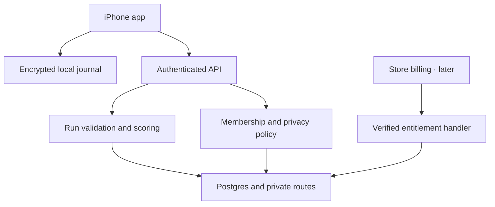
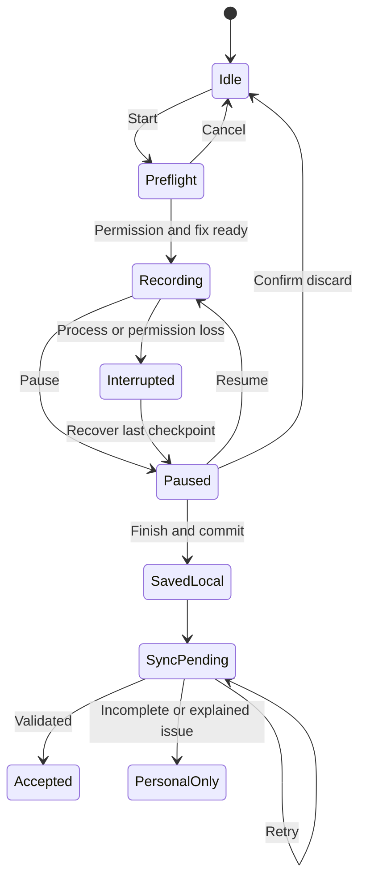

# PaceLeague — Technical specification

This is a proposed architecture for REQ-001 through REQ-015. No application code or infrastructure was created. Verify exact dependency versions against the selected Expo SDK at project kickoff; pin the lockfile and keep a compatibility record. Do not independently install the newest React Native into an Expo project.

## Recommended stack

| Layer | Recommendation | Reason / tradeoff |
|---|---|---|
| Mobile | React Native, Expo, TypeScript | Shared product code and a later Android path; native behavior still needs platform tests |
| Navigation | Expo Router with native stacks and standard four-tab navigation | Predictable deep links and isolated run flow; avoid unstable tab APIs unless deliberately validated |
| UI | React Native components, safe-area-context, tokenized styles, restrained Reanimated/haptics | Native semantics and an auditable design system; no heavy UI kit required |
| Recorder | expo-location and top-level expo-task-manager task | Documented foreground/background location path; prove locked-screen behavior first [S03] |
| Local persistence | expo-sqlite, SQLCipher in the native development build | Durable route batches, session state, and outbox; encryption key accessibility requires careful device verification [S08] |
| Credential/key storage | expo-secure-store | Refresh tokens and per-account database key; never AsyncStorage for secrets |
| Map | react-native-maps; Apple Maps on iOS initially | Known native renderer; provider attribution must remain in real screens [S09] |
| Remote backend | Supabase Auth, Postgres, private Storage, Edge Functions | One backend for identity, relational league rules and route objects; permissions require explicit design [S04] |
| Network state | TanStack Query for reads; a separate SQLite outbox for durable mutations | Query cache is not the authoritative recording journal |
| Validation | Runtime schemas, such as Zod, at every API boundary | Types alone cannot validate hostile payloads |
| Sharing | Dedicated view renderer + native share sheet | Share only selected statistics, not a screenshot of a private route screen |
| Reminders | expo-notifications, local only in V1 | Smaller operational/privacy footprint |
| Billing, later | RevenueCat + native store purchases | Consolidated entitlement lifecycle; development-build and sandbox verification required [S07, S11] |
| Diagnostics | Sentry candidate, subject to SDK/version and payload review | Error monitoring with explicit scrubbers and replay disabled; not yet configured |
| Analytics | Small first-party event table initially | Avoid an extra analytics vendor until the event model and data sharing are understood |
| Delivery | EAS development builds, TestFlight, CI using repository-native checks | Physical-device proof and traceable builds; cloud services require account setup |

**Native fallback:** if two focused fixes cannot meet the GPS checkpoint and locked-screen gates, compare a narrow native recorder module with a native iOS app. Decide on evidence before building the remaining UI. Web/PWA recording is not the target.

## System boundaries

The app persists effort locally before attempting upload. The API authenticates identity, validates input, checks object ownership/current membership, and calls the canonical domain operation. Supabase row policies and private Storage add defense in depth. A privileged backend credential bypasses some database controls and therefore must never be in the mobile bundle; its code still enforces the same explicit policies. A read-only league projection returns only the fields the league is entitled to see.

## Recorder state machine

- Keep recording state in SQLite, not only React memory. A single service serializes state changes and point writes. Keep one active session pointer per device/account; enforce it transactionally.
- Request a short foreground fix only while preflight is visible. Stop continuous subscription on Finish, Discard, or fatal permission loss. Do not auto-start GPS at app launch or from a reminder.
- Use high-accuracy samples appropriate to the active workout and a distance/update configuration chosen in the spike. OS scheduling is advisory; do not promise one sample per second.
- Store each point with sequence number, timestamp, horizontal accuracy, latitude/longitude, and segment ID. Save pause/resume events separately. Use monotonic elapsed time while alive; persist segment/checkpoint elapsed values for recovery, with UTC timestamps for server checks.
- Write a transaction when a batch arrives, with a target of no more than five seconds of received data uncommitted. If no callbacks arrive, mark poor signal; persistence cannot recover locations the OS never delivered.
- Display average active pace in V1, not a noisy instant pace. Active elapsed time excludes manual pauses; it is not claimed to be automatically detected moving time.
- Do not add distance across pause boundaries, invalid jumps, or GPS gaps over the configured gap threshold. Initial tuning values: fresh fix within 15 seconds, horizontal accuracy no worse than 50 m, gap threshold 15 seconds. Treat these as calibration inputs and version them.
- Flag implausible speed/jumps for review; an initial 12 m/s trigger is a heuristic, not proof of cheating. Validation quality is measurable; authenticity is not guaranteed by GPS alone. No monetary prizes in this design.
- A force-quit stops the promised recording service. Recovery uses the last stored checkpoint, labels the missing interval, and lets the user save the partial run or resume with a new segment. Never fill the gap with a straight line or elapsed time until reopen.
- Prepare a database key available while the device is locked after the first unlock, using an appropriate supported platform accessibility setting. Verify SQLCipher + background task + SecureStore together on the chosen SDK. A device reboot or an unavailable key must fail transparently; do not silently write an unencrypted replacement.

## Score contract — version 1

These are PaceLeague's proposed rules, not Runify's formula. They implement REQ-006/007. Show a plain-language rules sheet in the app.

1. A server-accepted recorded activity is eligible for scoring if it has at least 100 m and 60 seconds of active elapsed time, passes timestamp/segment checks, has at least 80% usable sample coverage under the implemented coverage definition, and is not held for a material anomaly. Short/incomplete runs remain personal history. Measure false rejection with actual routes before launch.
2. Scoring days and weeks in the pilot use the named IANA zone **America/Chicago**, disclosed in league rules. All users use the same competition calendar. User notification timezone is separate. Weeks begin Monday 00:00 and end the following Monday 00:00, using timezone-aware calendar arithmetic. Never assume a day is exactly 86,400 seconds.
3. Allocate each accepted segment's distance and active elapsed time to its competition day. A segment crossing midnight is split at the boundary using its timestamps. No client timezone override changes the scoring calendar.
4. Let D be the sum of accepted meters for a user/day and T the accepted active elapsed seconds. `distance_xp = min(100, floor(D / 100))`. `active_day_bonus = 25 if D >= 1000 and T >= 300 else 0`. `daily_xp = distance_xp + active_day_bonus`, maximum 125. Aggregate distance before flooring; splitting a run cannot increase the cap or rounding benefit.
5. Lifetime XP is the sum of credited daily XP. It never decreases because of rest. Deletion, duplicate correction, or invalidation triggers explicit recomputation and can decrease it. Explain the reason when a correction changes a tier.
6. Weekly league XP is the sum of the **three highest daily XP values** earned while a member during that league week, capped at 375. Compute league daily XP from the eligible post-join segments, rather than copying a lifetime daily total that could contain pre-join miles. Membership must remain active to appear in standings.
7. Scores remain provisional until the week closes plus 24 hours. Runs uploaded after that settlement deadline may add personal history/lifetime XP but do not add to the closed league week. Current-week runs should be uploaded promptly. Runs first received more than 72 hours after recording remain personal-only pending a documented review; never silently backdate them. Deletions and integrity corrections can revise a closed week, with a revision label.
8. Tied scores receive the same competition rank (1, 2, 2, 4). Alias/ID sort is only for stable row order, never a tie-breaking reward. Weekly results do not demote permanent tiers.

Leaving and rejoining starts a new membership period. Earlier segments from a previous membership period do not reappear in the current-week score; the leave confirmation explains this. Keep membership-period records so scoring cannot accidentally reuse an old join timestamp. Personal lifetime XP is unaffected by leaving a league.

### Tier thresholds

| Tier | Minimum lifetime XP | Next tier |
|---|---:|---:|
| Seed | 0 | 500 |
| Stride | 500 | 1,500 |
| Tempo | 1,500 | 4,000 |
| Surge | 4,000 | 10,000 |
| Elite | 10,000 | None in V1 |

The in-tier progress fraction is `(XP - tier_floor) / (next_tier_floor - tier_floor)`. Elite shows a completed tier and lifetime XP; no fictional next threshold. Changing the rules requires a versioned migration and an explicit policy on old scores, preferably at a future week boundary.

### Golden fixtures

| Case | Expected result |
|---|---|
| First 5,240 m / 1,888 s run of day | 52 distance + 25 active-day = 77 XP |
| Same run uploaded twice | Still 77 XP |
| Two accepted 2,620 m runs same day | Combined 5,240 m → 77 XP total, not 102 |
| 600 m / 240 s followed by 400 m / 180 s | Daily total 1,000 m / 420 s → 35 XP |
| 10,000 m or more plus at least 300 s in one day | Daily maximum 125 XP |
| Daily scores 125, 100, 80, 77 | Weekly league score 305; all 382 still count toward lifetime XP |
| Monday 6.60 km, Wednesday 6.40 km, Friday 5.24 km | 91 + 89 + 77 = 257 weekly XP |
| Lifetime 820 before Friday's run | 897 after; 603 to Tempo; in-tier progress 39.7% |
| User changes phone timezone | No change to competition-day allocation |
| Delete Friday's run | Recompute affected totals from remaining accepted data; reverse 77 if no other same-day activity |

The 80% coverage metric must be implemented as usable recorded active-time intervals divided by total active elapsed time, capped per adjacent sample gap at the accepted gap threshold; gaps are not bridged. Timestamp manipulation and GPS spoofing remain risks. Store the validator version, reasons, and a personal-only fallback; do not accuse a runner based on a single heuristic.

## Proposed data model

| Entity | Core fields | Ownership / constraints |
|---|---|---|
| profiles | user_id, alias, units, goal_days, notification_tz, eligibility_ack_at | User-owned settings; server-controlled status; email stays in auth provider |
| runs | id, owner_id, client_run_id, start/end UTC, active_ms, distance_m, source, status, version, validator_version, title | Unique `(owner_id, client_run_id)`; client cannot edit accepted totals |
| route_chunks | run_id, sequence, checksum, staged object key, point_count | Unique `(run_id, sequence)`; owner-only staged access; immutable after finalize |
| run_routes | run_id, private object key, checksum, segmentation metadata | Never returned by league endpoints; authenticated owner retrieval |
| daily_scores | owner_id, competition_date, rule_version, distance_m, active_ms, xp, revision | Unique per user/date/rule; server writes only |
| xp_ledger | id, owner_id, date, cause_id, revision, delta, created_at | Append corrections; unique cause/revision; no client writes |
| leagues | id, name, owner_id, calendar_zone, capacity, status | Owner actions validated; zone fixed for the pilot |
| league_members | league_id, user_id, joined_at, left_at, role | One active league per user; capacity checked in transaction |
| league_invites | id, league_id, token_hash, expires_at, revoked_at, creator_id | Random link/code; expiry seven days; no plain token logs |
| league_week_scores | league_id, week_start, member_id, xp, revision, settled_at | Derived projection; never a client-writable score table |
| blocks / reports | reporter/blocker, target, reason code, content snapshot, status | Minimum necessary data; moderator access only for reports |
| deletion_jobs / export_jobs | owner_id, requested_at, state, retry_count, expiry, result key | Recent-auth request; bounded retry; private result delivery |
| operational_events | event_id, schema_version, environment, allowlisted fields | Redacted and deduplicated; short retention |
| entitlements / billing_events | user_id, provider IDs, product, verified state, expiry, event_id | V1.1 only; unique provider event; server updates |

Local tables: `active_session`, `track_points`, `session_events`, `saved_runs`, `outbox`, `cached_summaries`, and schema version. Namespace databases and network caches by verified account identity. Sign-out stops recording or asks the user to finish/discard first, warns about unsynced work, cancels reminders, locks that account's encrypted database, and clears displayed/query caches. Unsynced records can only be reopened by that same account. Explicit local deletion removes the database/key after confirmation; do not destroy a pending run merely because a token expires.

## API outline and transaction rules

These are proposed contracts, not deployed URLs. All endpoints use HTTPS, runtime schema validation, explicit size limits, and sanitized error codes. Derive the caller from a verified token. Reject caller-supplied owner/role/XP fields.

| Operation | Inputs | Result / controls |
|---|---|---|
| POST /runs | client_run_id, start metadata, source | Create/reuse owned upload session; same idempotency key + changed body → conflict |
| PUT /runs/{id}/chunks/{seq} | points, checksum | Owner check, 500-point/128-KiB cap, checksum match for retries |
| POST /runs/{id}/finalize | expected version, ordered manifest, pause events | Validate completeness; queue processing; return pending/accepted/personal-only with reason |
| GET /runs and /runs/{id} | cursor/limit, owned ID | Paginated own history; route requires separate authorized owner fetch |
| PATCH /runs/{id} | title, expected version | Title only; block attempts to edit accepted statistics |
| DELETE /runs/{id} | expected version | Tombstone + score recalculation + route cleanup; idempotent |
| POST /leagues and /leagues/join | name or invite token | Current membership/capacity transaction; explicit user action |
| GET /leagues/{id}/standings | week, cursor | Current membership + block filtering; no raw routes/contact fields |
| POST /reports and /blocks | bounded target/reason | Access validation, abuse limits, no unrestricted text upload |
| POST /exports and /account/deletion | recent-auth proof | Async job ID; user can view own status |
| POST /billing/webhook | authenticated provider event | V1.1; verify configured signature/auth, persist event once, reconcile provider state |

Finalize should produce one durable job and transactional outbox record before acknowledgement. A retry resumes the same job. The worker recomputes statistics from staged points, locks affected daily-score rows in a stable order, and commits run acceptance, daily-score revisions, ledger deltas, and projection-update intent atomically. Two runs on one day must not each receive an independent day bonus. League projection workers are idempotent and expose their last update time; an asynchronous league update must not change a confirmed personal save into an error.

Use retry with capped exponential backoff and jitter for network/5xx errors, honor rate-limit responses, and stop automatic retries for permanent validation errors. Reauth is single-flight. Local outbox states are pending, uploading, awaiting-validation, succeeded, and needs-attention. App termination can leave any nonterminal state; resuming must inspect server state before re-sending work. Remove route payloads from logs, crash breadcrumbs, and error strings.

Every worker checks current account/run tombstones immediately before committing. A late upload, score job, or entitlement notification must not resurrect a deleted account or run. If a recording reaches the route-point limit, preserve its local summary and explain the upload limitation; never discard the completed effort or fabricate a truncated accepted route.

Starting rate limits to tune in the pilot: five invite attempts per minute, three export requests per day, one active export/deletion job per account, and 50-row history pages. Recording remains local during throttling. Do not use request limits as a substitute for byte, point-count, job-concurrency, and database capacity controls.

## Guardrail map

| Concern | Authority / enforcement | Denied behavior | Evidence / bypass status |
|---|---|---|---|
| Account identity | Verified JWT at every API entry; server-derived subject | 401 before private access | EV-001/010; proposed, unverified |
| Own run and route | Canonical owner policy + RLS + private object path | Non-disclosing 404 or denied result | Other-user GET/PUT/export tests |
| League membership | Current server membership, not cached role | No standings after removal | Direct endpoint and stale-token tests |
| XP integrity | Validation/scoring transaction; revoked client grants | Ignore/reject submitted XP; audit reason | Concurrency, replay and direct-table tests |
| Purchase entitlement | Provider verification and expiry | Core stays free; premium disabled appropriately | Forged/out-of-order event tests |
| Admin/moderator access | Restricted operator roles; logged reason/action | No routine route access | Role and audit-payload tests |
| Deletion | Recent-auth request plus lifecycle worker | No other-account job creation | Partial failure and restore drill |
| Secrets | Build config boundary + repository checks | No privileged keys in client | Bundle scan and deployment review |

CI should prohibit privileged database/vendor imports in mobile code, reject committed credentials, exercise route/privacy negative cases, and run scoring fixtures. Developer instructions guide behavior; server policies and tests enforce it. No guardrail is claimed implemented by this document.

## Data lifecycle and operational boundaries

Proposed defaults, to confirm before collecting real data:

- Accepted run summaries and private routes remain until the owner deletes them or their account. Private cloud data is processed by the operator/providers under access controls; this is **not an end-to-end encryption claim**.
- Staged failed uploads expire after seven days; a device with unsynced data warns before any user-requested removal. Local acknowledged route cache targets the most recent five runs with a 50-MB ceiling; older summaries remain available from the server. Never evict an unacknowledged run automatically to make room.
- Operational logs retain 14 days, aggregated product metrics 90 days initially, report records 90 days after resolution unless a documented obligation requires another period. These periods are design proposals, not legal conclusions.
- Deletion immediately disables access/visibility, then removes route objects, summaries, score links, memberships, export files, local data on active devices, and identity records. Retry failures with bounded backoff and human alert. Primary cleanup target seven days; backup expiry target 30 days requires provider verification. Apply deletion tombstones before serving any restored backup. Offline devices clear caches at next authenticated contact; local device copies cannot be remotely guaranteed erased while offline.
- Exports include private data only for the requesting owner. Deliver through an authenticated owner-checked endpoint with a five-minute request nonce bound to that account; do not hand out an unauthenticated bearer download URL. Delete export objects within 24 hours. Download credentials never appear in logs or league responses.
- Billing/account deletion must explain that store billing is managed separately [S06]. Retain only the minimum justified billing/security records under an owner-approved retention policy; do not retain routes to support billing.

## Premium and integration boundaries

RevenueCat requires real product configuration and purchase tests. Verify the current webhook plan entitlement/cost before selecting it [S11]. Authenticate callbacks using the documented configured mechanism; persist/deduplicate event IDs, then fetch current provider state to tolerate event ordering. A canceled subscription normally remains active through its paid expiry; pending is not active; refund/revocation removes access; billing grace follows verified provider state. Cap any offline cached premium access at both its verified expiry and a proposed 72-hour refresh window. Do not infer entitlement from a success animation.

Use a stable authenticated app-user ID; never merge store entitlements between two app accounts solely because the device is the same. Define restore/transfer policy explicitly, including deletion/recreation, and verify it in the store sandbox before sales.

HealthKit, Garmin, and Android Health Connect are later projects requiring narrow permissions, provenance and duplicate handling. A HealthKit integration is not a standalone Apple Watch app. Do not count the same activity once from GPS and again from an import. Strava is excluded pending explicit suitability/provider review: its June 2026 API agreement restricts competing applications and display of another athlete's data [S12]. User consent alone does not establish permission for the proposed competitive use. No alternative route is specified to circumvent these terms.

## Proposed repository layout

Use an Expo Router `app/` directory only for routes/layouts; put reusable work elsewhere. Suggested paths: `src/features/recording/`, `src/features/progress/`, `src/features/leagues/`, `src/features/account/`, `src/features/billing/`; `src/components/`; `src/design/`; `src/db/`; `src/api/`; `src/domain/scoring/`; `supabase/migrations/`; `supabase/functions/`; `tests/scoring/`; `tests/access/`; `tests/device-scenarios/`.

Record exact Expo, React Native, SQLite/SQLCipher, location, maps, purchase, iOS deployment target, Xcode/EAS image, and Android SDK versions in a compatibility file when building. Recheck official documentation then. No exact package version, scaffold command, or integration is claimed tested in this packet.

## Source links

[S03]: https://docs.expo.dev/versions/latest/sdk/location/
[S04]: https://supabase.com/docs/guides/database/postgres/row-level-security
[S06]: https://developer.apple.com/support/offering-account-deletion-in-your-app/
[S07]: https://www.revenuecat.com/docs/getting-started/installation/expo
[S08]: https://docs.expo.dev/versions/latest/sdk/sqlite/
[S09]: https://docs.expo.dev/versions/latest/sdk/map-view/
[S11]: https://www.revenuecat.com/docs/integrations/webhooks
[S12]: https://www.strava.com/legal/api

[Full source register](../SOURCES.md).
